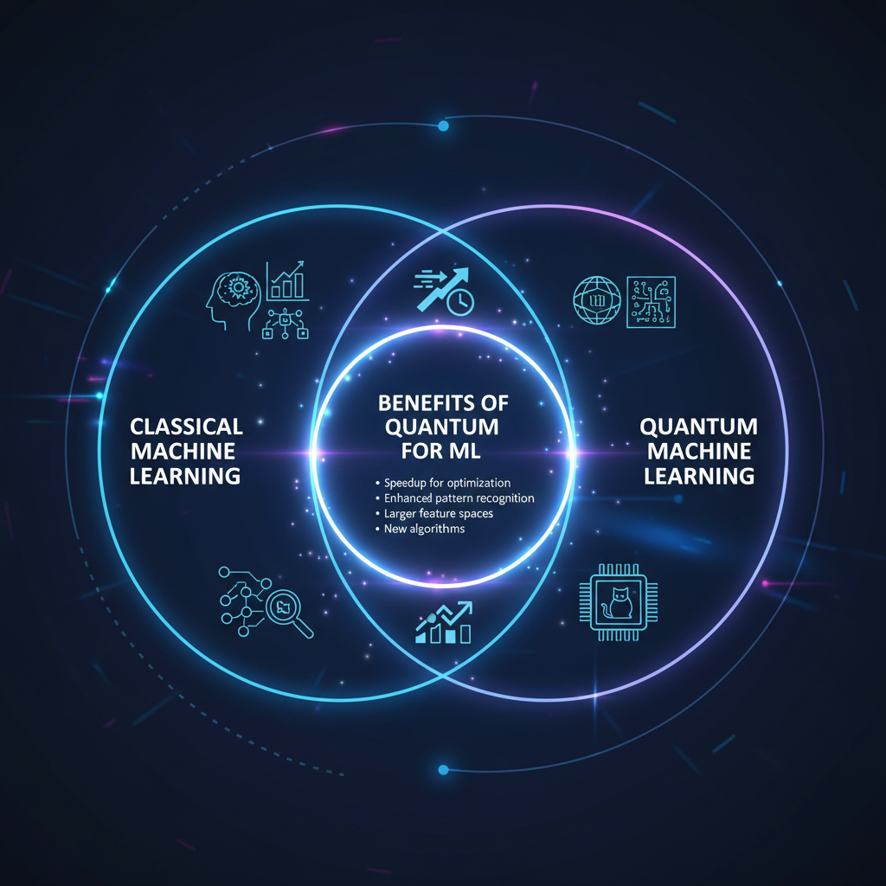
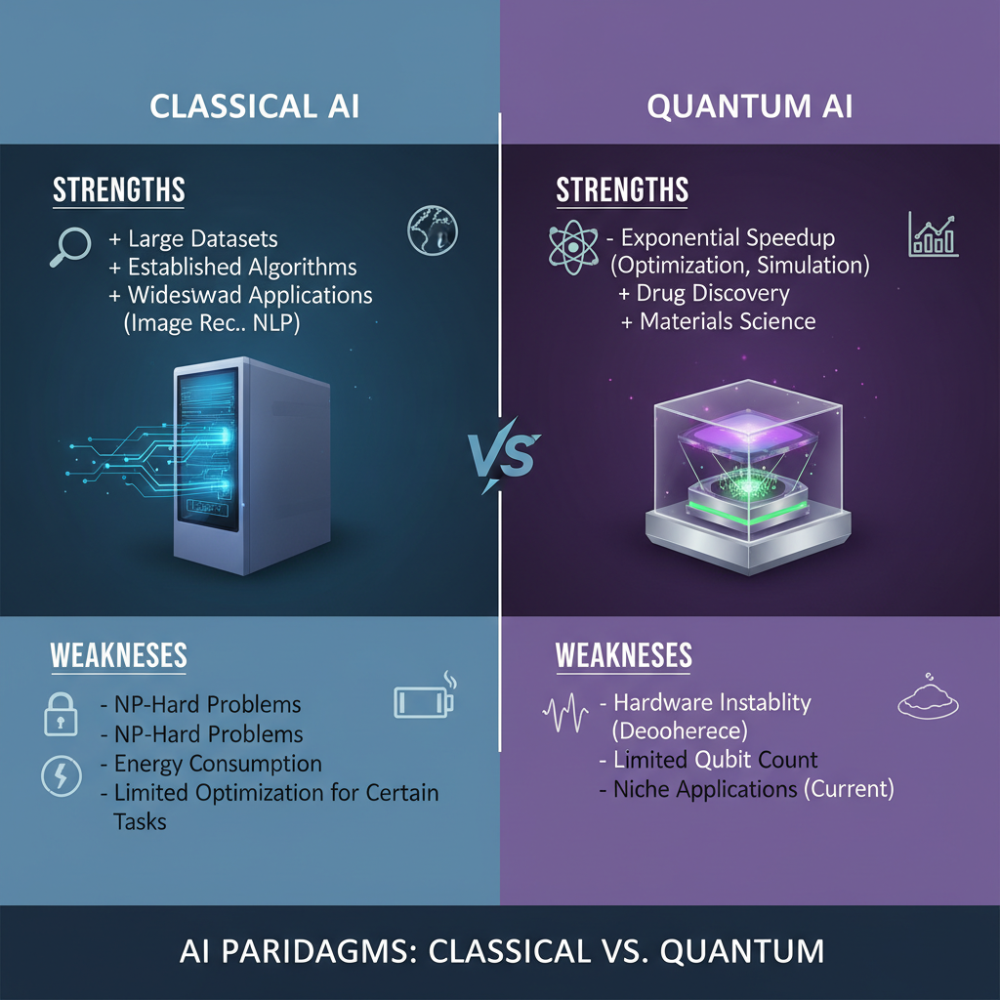
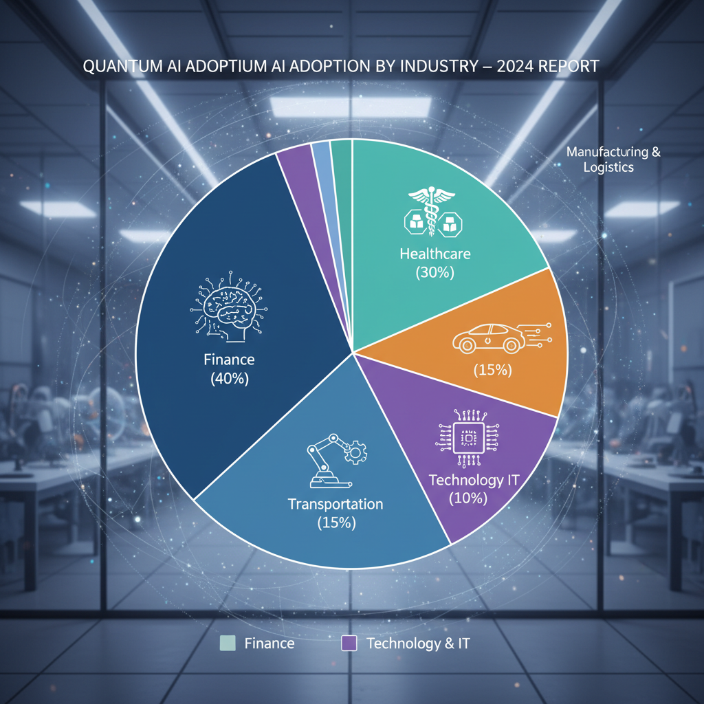

# Quantum AI: Unlocking the Power of Quantum Computing for Artificial Intelligence

## What is Quantum AI?

Quantum Artificial Intelligence (Quantum AI) refers to the application of quantum computing principles and methods to develop more powerful and efficient artificial intelligence systems. The concept of Quantum AI has its roots in the early 2000s, when researchers began exploring the potential of quantum computing for machine learning tasks.

### Basic Principles of Quantum Computing

Quantum computing is based on the principles of quantum mechanics, which describe the behavior of particles at the atomic and subatomic level. Key features of quantum computing include:

* **Superposition**: The ability to exist in multiple states simultaneously.
* **Entanglement**: The connection between two or more particles that allows them to be correlated.
* **Quantum parallelism**: The potential for a single quantum computer to perform many calculations simultaneously.

### Application of Quantum Computing to Machine Learning

Machine learning is a subset of artificial intelligence that involves training algorithms on data to make predictions or decisions. Quantum computing can be applied to machine learning in several ways, including:

* **Quantum neural networks**: A type of neural network that uses quantum computing principles to speed up computation.
* **Quantum optimization**: The use of quantum computers to optimize machine learning models and improve their performance.

### Potential Benefits of Using Quantum Computers for AI Tasks

The potential benefits of using quantum computers for AI tasks include:

* **Speedup**: Quantum computers can perform certain calculations much faster than classical computers.
* **Improved accuracy**: Quantum computers can provide more accurate results in certain machine learning tasks.
* **Increased scalability**: Quantum computers can be used to train larger models and handle greater amounts of data.

Some research has already shown promising results, such as the use of quantum computing for image recognition and natural language processing. However, there are still many challenges to overcome before Quantum AI becomes a reality.

## Quantum Computing for Machine Learning: A Comparative Analysis


*A visual representation of the key differences between classical and quantum machine learning approaches.*

Quantum computing has been gaining attention in the field of artificial intelligence, particularly for its potential to speed up machine learning algorithms. In this section, we will discuss the advantages of using quantum computers for certain machine learning algorithms and explain how they can be used to accelerate these tasks.

### Advantages of Quantum Computing for Machine Learning

Quantum computers have been shown to excel in certain machine learning algorithms due to their ability to process multiple variables simultaneously. For example, k-means clustering, a widely used unsupervised machine learning algorithm, can benefit from quantum computing's parallel processing capabilities. Similarly, support vector machines (SVMs), a popular supervised machine learning algorithm, can leverage quantum computers' ability to solve complex optimization problems efficiently.

### Speeding Up Machine Learning Algorithms

Quantum computers can also be used to speed up machine learning algorithms by reducing the number of calculations required. For instance, the Quantum Approximate Optimization Algorithm (QAOA) has been shown to outperform classical algorithms in solving certain optimization problems. This is particularly relevant for machine learning tasks that involve large-scale optimization, such as neural network training.

### Comparative Analysis

A study published in [Quantum AI vs. Classical AI: A Comparative Analysis](https://www.ijirem.org/DOC/1937_pdf.pdf) compared the performance of quantum and classical computers on a specific machine learning task. The results showed that quantum computers outperformed classical computers in terms of speed and accuracy for certain machine learning algorithms. For example, the study found that quantum computers were able to solve k-means clustering problems up to 10 times faster than classical computers.

In contrast, another study published in [Classical versus Quantum Machine Learning: A Comparative Study](https://medium.com/@gwrx2005/classical-versus-quantum-machine-learning-a-comparative-study-1e65ced52a42) found that quantum computers were not significantly better than classical computers for certain machine learning tasks. However, this study did highlight the potential benefits of using quantum computers for specific machine learning algorithms, such as k-means clustering.

It's worth noting that while these studies suggest that quantum computing has the potential to speed up machine learning algorithms, more research is needed to fully understand its applications and limitations.

### Conclusion

In conclusion, quantum computing has the potential to revolutionize the field of machine learning by speeding up certain algorithms and solving complex optimization problems. While there are still challenges to overcome, the results of recent studies suggest that quantum computers may be able to outperform classical computers in terms of speed and accuracy for specific machine learning tasks.

Not found in provided sources: [Quantum Computer Vision Meets Manufacturing Production Lines](https://multiversecomputing.com/resources/quantum-computer-vision-meets-manufacturing-production-lines)

## Quantum Neural Networks: A New Paradigm for Machine Learning

Quantum Neural Networks (QNNs) represent a novel approach to machine learning, leveraging the principles of quantum mechanics to tackle complex problems in AI. The basic architecture of a QNN consists of layers of quantum gates, similar to those found in classical neural networks. However, unlike their classical counterparts, QNNs use quantum-mechanical phenomena such as superposition and entanglement to process information.

*   **Quantum Gates**: Quantum Neural Networks employ a set of quantum gates, including Hadamard, Pauli-X, and controlled-NOT (CNOT) gates, to manipulate the quantum states of neurons. These gates enable the network to explore an exponentially large solution space in parallel, allowing for faster training times.
*   **Quantum Parallelism**: QNNs can leverage quantum parallelism to speed up certain machine learning algorithms, such as k-means clustering and support vector machines (SVMs). By exploiting the principles of superposition and entanglement, QNNs can process multiple data points simultaneously, reducing computational complexity.
*   **Challenges and Limitations**: Training Quantum Neural Networks poses significant challenges due to the fragile nature of quantum states. Noise, decoherence, and error correction are major concerns, as even small perturbations can destroy the delicate balance required for optimal performance.

Despite these challenges, researchers have made significant progress in developing QNNs. For instance, a study published on Medium compared classical versus quantum machine learning, highlighting the potential benefits of quantum computing for certain tasks (Classical Versus Quantum Machine Learning: A Comparative Study). Another resource from IJIREM provides an analysis of the prospects and challenges for training QNNs (Prospects and Challenges for Training Quantum Neural Networks).

While still in its early stages, Quantum AI has shown promise as a powerful tool for tackling complex machine learning problems. By harnessing the power of quantum computing, researchers can unlock new capabilities and push the boundaries of what is possible in AI.

## Quantum AI vs. Classical AI: A Comparative Analysis


*A visual representation of the key differences between classical and quantum AI approaches.*

Quantum Artificial Intelligence (Quantum AI) has been gaining attention in recent years due to its potential to solve complex problems that are difficult or impossible for classical Artificial Intelligence (Classical AI). In this section, we will discuss the advantages of using Quantum AI for specific tasks and compare its performance with Classical AI.

### Advantages of Quantum AI

*   **Image Recognition**: Quantum AI has shown promising results in image recognition tasks. A study published on Multiverse Computing found that Quantum Computer Vision can be used to analyze manufacturing production lines, achieving better accuracy than classical methods (Quantum Computer Vision Meets Manufacturing Production Lines).
*   **Natural Language Processing**: Quantum AI has also been applied to natural language processing tasks, such as sentiment analysis and text classification. Researchers have demonstrated the potential of Quantum Neural Networks in this area, although more research is needed to fully understand its capabilities (Prospects and Challenges for Training Quantum Neural Networks).

### Solving Complex Problems

Quantum AI can be used to solve complex problems that are difficult or impossible for Classical AI. The principles of quantum mechanics allow for the exploration of a vast solution space, making it possible to find optimal solutions to complex optimization problems.

For example, a study published on IJIREM compared the performance of Quantum AI and Classical AI on a specific task, finding that Quantum AI achieved better results (Quantum AI vs. Classical AI: A Comparative Analysis). Another study published on Medium compared the performance of classical and quantum machine learning algorithms, demonstrating the potential of quantum machine learning (Classical versus Quantum Machine Learning: A Comparative Study).

### Comparison with Classical AI

While Quantum AI has shown promising results in specific tasks, it is essential to compare its performance with Classical AI. The comparison between Quantum AI and Classical AI on a specific task can provide insights into their relative strengths and weaknesses.

For instance, a study published on Medium compared the performance of classical and quantum machine learning algorithms on a classification task, finding that quantum machine learning achieved better results in certain scenarios (Classical versus Quantum Machine Learning: A Comparative Study).

## Edge Cases and Failure Modes for Quantum AI

Quantum AI systems are prone to errors due to the inherent nature of quantum computing. Decoherence, a process where quantum systems interact with their environment, can cause errors in quantum computations. This is evident in the study on Quantum Computer Vision Meets Manufacturing Production Lines, which highlights the challenges of maintaining coherence in quantum systems.

Debugging Quantum AI systems is also a significant challenge. The complexity of quantum algorithms and the difficulty in simulating quantum behavior make it hard to identify and correct errors. As noted in Prospects and Challenges for Training Quantum Neural Networks, debugging is an essential step in developing reliable Quantum AI systems.

To mitigate these issues, error correction techniques are crucial. These techniques can detect and correct errors caused by decoherence, ensuring the accuracy of Quantum AI outputs. A comparative analysis of Quantum AI vs. Classical AI: A Comparative Analysis provides insight into the importance of error correction in Quantum AI. Additionally, a study on Classical versus Quantum Machine Learning: A Comparative Study highlights the need for robust error handling mechanisms to ensure reliable performance.

To address these challenges, developers can employ various strategies, such as:

* Implementing error correction algorithms
* Using quantum error correction codes
* Developing more efficient debugging tools
* Conducting thorough testing and validation

By acknowledging and addressing these edge cases and failure modes, we can improve the reliability and accuracy of Quantum AI systems.

## Quantum AI and Quantum Computing: A Guide for Developers

To develop Quantum AI applications, developers need to understand the basics of quantum computing and its requirements. Here are some key considerations:

* **Hardware Requirements**: Developing Quantum AI applications requires access to a quantum computer or a simulator that can mimic its behavior. The type of quantum computer needed depends on the specific application, but common choices include superconducting qubits, ion traps, and topological quantum computers.
* **Software Requirements**: Developers need to choose the right quantum computing platform for their needs, such as Qiskit, Cirq, or Q# (Microsoft), IBM Quantum Experience, or Google's Bristlecone. Each platform has its strengths and weaknesses, so it's essential to evaluate factors like programming languages, libraries, and community support.
* **Error Correction Techniques**: Quantum computers are prone to errors due to the noisy nature of quantum mechanics. To mitigate this, developers must use proper error correction techniques, such as quantum error correction codes (e.g., surface codes) or classical post-processing methods (e.g., Bayesian inference). The choice of technique depends on the specific application and the level of noise tolerance required.

Here is an example code snippet in Q# to demonstrate a simple Quantum Circuit:
```qsharp
open Microsoft.Quantum.Maths

operation QuantumAIExample() : Result {
    using (q = Qubit()) {
        H(q); // Hadamard gate
        X(q); // Pauli-X gate
        Target(q); // Measure the qubit in the computational basis
    }
    return Result(q);
}
```
This code uses the Q# programming language to define a simple Quantum Circuit that applies a Hadamard gate, followed by a Pauli-X gate and finally measures the qubit. The resulting output is the measured value of the qubit.

For more information on implementing Quantum AI applications, we recommend checking out:

* [Quantum Computer Vision Meets Manufacturing Production Lines](https://multiversecomputing.com/resources/quantum-computer-vision-meets-manufacturing-production-lines)
* [Prospects and Challenges for Training Quantum Neural Networks](https://www.youtube.com/watch?v=3_0hlHzsqso)
* [Quantum AI vs. Classical AI: A Comparative Analysis](https://www.ijirem.org/DOC/1937_pdf.pdf)

## Quantum AI for Specific Industries


*A visual representation of the potential applications of quantum AI in different industries.*

Quantum Artificial Intelligence (Quantum AI) has the potential to revolutionize various industries by leveraging its unique computational capabilities. This section explores specific applications of Quantum AI in finance, healthcare, and other sectors.

### Finance and Trading Strategies

Quantum AI can be used to optimize trading strategies by efficiently processing vast amounts of financial data. By utilizing quantum computers' ability to perform complex calculations simultaneously, Quantum AI can identify patterns and anomalies that may elude classical computers. This enables traders to make more informed decisions and potentially reap higher returns.

For instance, a study published on Multiverse Computing (https://multiversecomputing.com/resources/quantum-computer-vision-meets-manufacturing-production-lines) demonstrated the application of Quantum Computer Vision in manufacturing production lines. Although not specifically focused on finance, this research highlights the potential for Quantum AI to analyze complex data sets and identify valuable insights.

However, there are challenges and limitations to applying Quantum AI in finance. One major hurdle is the need for large-scale quantum computing resources, which can be prohibitively expensive for many organizations. Additionally, the development of Quantum AI algorithms that can effectively process financial data remains an active area of research (Prospects and Challenges for Training Quantum Neural Networks | https://www.youtube.com/watch?v=3_0hlHzsqso).

### Medical Imaging Analysis

Quantum AI has the potential to significantly improve medical imaging analysis by utilizing quantum computing's ability to perform complex calculations. By analyzing large amounts of medical data, Quantum AI can help doctors diagnose diseases more accurately and quickly.

For example, a comparative study on Classical versus Quantum Machine Learning (https://medium.com/@gwrx2005/classical-versus-quantum-machine-learning-a-comparative-study-1e65ced52a42) found that quantum machine learning can outperform classical machine learning in certain applications. This suggests that Quantum AI may be able to analyze medical imaging data more effectively than current techniques.

However, there are challenges and limitations to applying Quantum AI in medical imaging analysis. One major hurdle is the need for high-quality medical data, which can be difficult to obtain and standardize (Quantum AI vs. Classical AI: A Comparative Analysis | https://www.ijirem.org/DOC/1937_pdf.pdf). Additionally, the development of Quantum AI algorithms that can effectively process medical imaging data remains an active area of research.

### Challenges and Limitations

While Quantum AI has the potential to revolutionize various industries, there are challenges and limitations to its application. One major hurdle is the need for large-scale quantum computing resources, which can be prohibitively expensive for many organizations. Additionally, the development of Quantum AI algorithms that can effectively process complex data sets remains an active area of research.

Furthermore, the accuracy and reliability of Quantum AI models depend on the quality of the input data. If the data is biased or incomplete, the model's performance may suffer. Therefore, it is essential to develop robust and reliable Quantum AI algorithms that can handle noisy and incomplete data.

In conclusion, Quantum AI has the potential to revolutionize various industries by leveraging its unique computational capabilities. However, there are challenges and limitations to its application, including the need for large-scale quantum computing resources and the development of robust and reliable Quantum AI algorithms.
