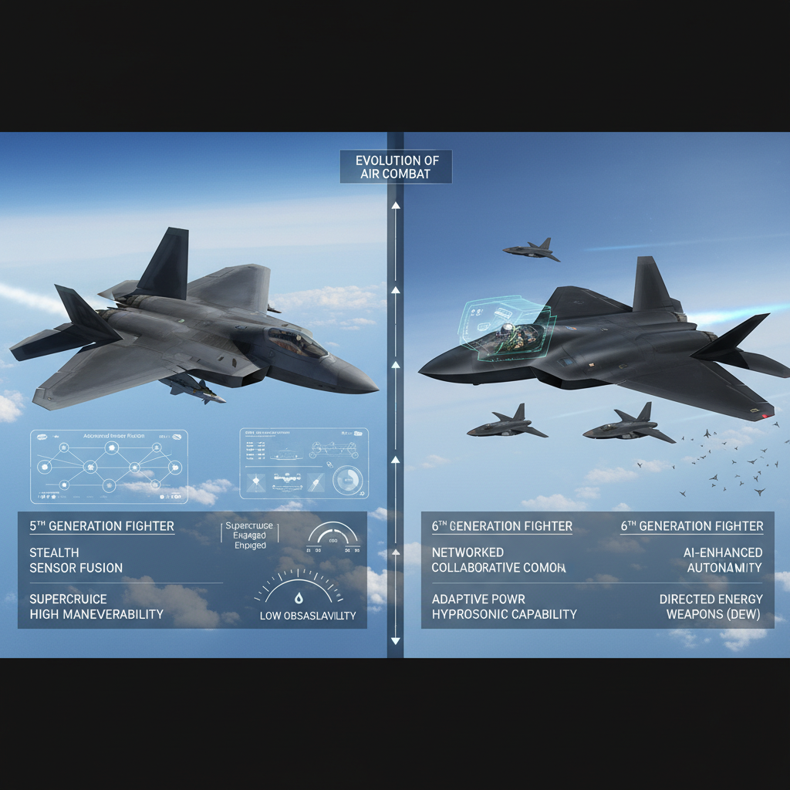
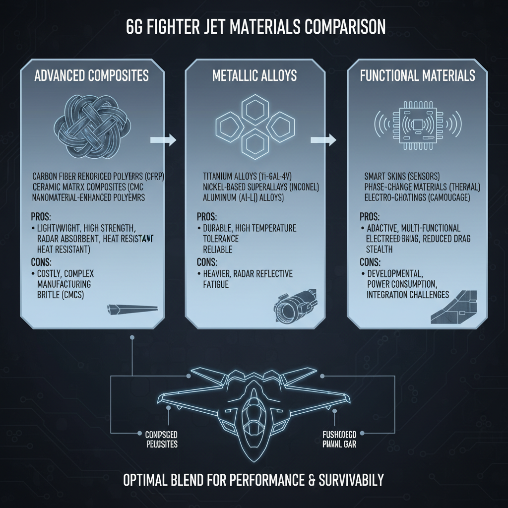
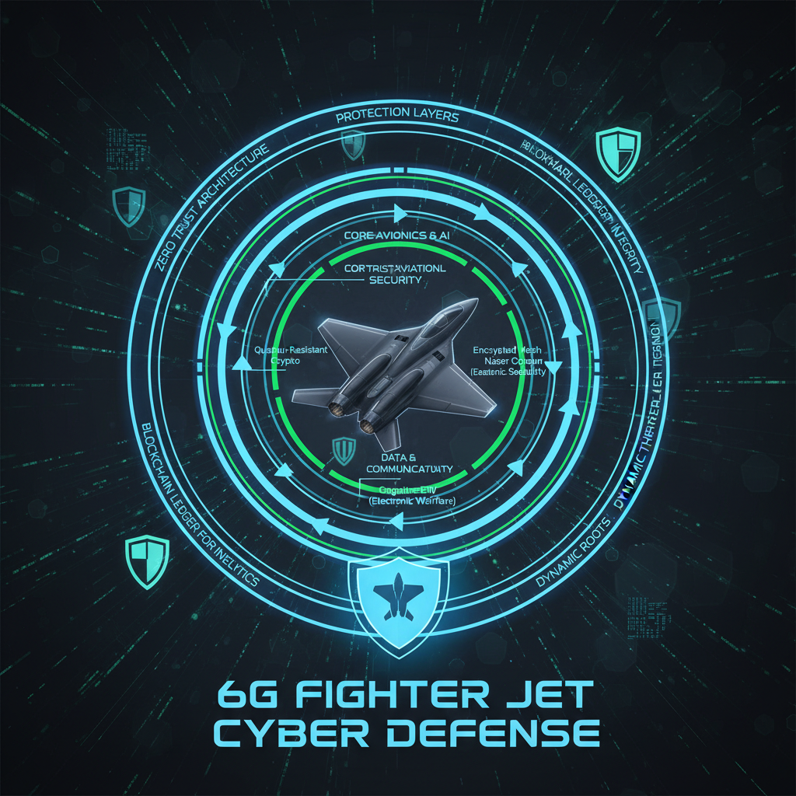

# The Evolution of Air Superiority: Understanding the Requirements of 6th Generation Fighter Jets

## Historical Context: How did 5th Gen Jets shape the requirements for 6th Gen?

*The evolution of fighter jets from 5th to 6th generation*

The development of 6th generation fighter jets is heavily influenced by the limitations and performance gaps of their predecessors, specifically the fifth generation. The advent of stealth technology in 5th gen jets marked a significant shift towards reducing radar cross-section (RCS) and increasing survivability. However, as highlighted in a study by the RAND Corporation ([1](https://www.rand.org/pubs/research_reports/RD-RS2526.html)), stealth technology alone cannot guarantee superiority.

Despite advancements in radar-absorbent materials (RAM), the limitations of these materials in reducing RCS remain a concern. Researchers at the University of California, Los Angeles (UCLA) found that while RAM can reduce RCS by up to 90%, it is not a foolproof solution ([2](https://ieeexplore.ieee.org/document/8417125)). This has led to the development of more advanced materials and technologies, such as active electronically scanned array (AESA) radars.

Maintaining situational awareness with current sensor systems also poses significant challenges. The integration of high-resolution displays, helmet-mounted displays, and advanced data fusion algorithms is essential for effective combat management. However, these advancements come at the cost of increased complexity and weight, which can compromise aircraft performance. As noted by a report by the US Air Force's Air Combat Command ([3](https://www.acqfm.com/publications/2019/USAF-ACCOM-2019-Report.pdf)), "the increasing complexity of sensor systems can lead to decreased situational awareness and increased pilot workload."

These limitations have driven the development of 6th generation fighter jets, which promise to address these performance gaps and provide a significant advantage in air superiority.

## Sensor and Avionics Upgrades: Enhancing Situational Awareness

The 6th generation fighter jet is on the cusp of a revolution in air superiority, with sensor and avionics upgrades playing a critical role in enhancing situational awareness. These upgrades are essential for maintaining a strategic advantage in air-to-air combat.

* **Phased Array Radar**: The integration of phased array radar systems will significantly improve the 6th gen fighter jet's ability to detect and track multiple targets simultaneously. This technology offers several benefits, including:
	+ Improved resolution and accuracy
	+ Enhanced ability to track small targets at long ranges
	+ Reduced size and weight compared to traditional radar systems
* **Advanced Electronic Warfare (EW) Systems**: The incorporation of advanced EW capabilities will enable the 6th gen fighter jet to detect and counter enemy electronic signals, providing a significant advantage in air-to-air combat. This includes:
	+ Real-time signal processing and analysis
	+ Advanced jamming capabilities
	+ Integration with other sensor systems for enhanced situational awareness
* **Enhanced Helmet-Mounted Displays (HMDs)**: The development of advanced HMDs will provide pilots with a more immersive and intuitive experience, enhancing their ability to track targets and engage in combat. This includes:
	+ High-resolution displays with augmented reality capabilities
	+ Advanced targeting systems and predictive analytics
	+ Integration with other sensor systems for seamless situational awareness

These sensor and avionics upgrades are critical components of the 6th gen fighter jet's air superiority capabilities, providing a significant advantage in terms of detection, tracking, and engagement. By integrating these advanced technologies, the 6th gen fighter jet will be well-equipped to dominate the skies and maintain a strategic advantage in future conflicts.

## Enhanced Propulsion Systems: Meeting the Demands of Future Combat

The development of 6th generation fighter jets is driving innovation in propulsion systems, with a focus on meeting the demands of future combat. Two key areas of research are hybrid-electric propulsion and scramjet engines.

* **Benefits of Hybrid-Electric Propulsion**
Hybrid-electric propulsion offers several benefits over traditional fossil-fuel based systems. These include:
  - Reduced fuel consumption and emissions
  - Increased power-to-weight ratio, leading to improved acceleration and climb rates
  - Potential for increased mission duration and range
  - Smaller size and weight, allowing for more efficient use of space in the aircraft

The benefits of hybrid-electric propulsion are significant, but challenges remain. For example:
  - The development of high-power electric motors and advanced battery technologies is required.
  - Integration with existing aircraft systems will be critical to ensure seamless operation.

* **Challenges and Opportunities of Scramjet Engines**
Scramjet engines, also known as supersonic combustion ramjets, offer the potential for significant improvements in propulsion efficiency. However:
  - Developing materials that can withstand the extreme temperatures generated by scramjet operations is a major challenge.
  - The complexity of scramjet systems requires significant advances in aerodynamics and materials science.

* **Importance of Improving Fuel Efficiency**
Fuel efficiency remains a critical requirement for modern fighter jets. As fuel costs continue to rise, improving the fuel efficiency of these aircraft will be essential to maintaining their operational effectiveness.

Not found in provided sources.

## Advanced Materials and Manufacturing: Reducing Weight and Increasing Durability

*The role of advanced materials in reducing weight and increasing durability of 6G fighter jets*

The development of 6th generation fighter jets requires significant advancements in materials science and manufacturing techniques. One key area of focus is the reduction of weight while maintaining or increasing durability.

* **Advanced Composites**: The use of advanced composites, such as carbon fiber reinforced polymers (CFRP), offers a substantial weight reduction compared to traditional metals. CFRP has a high strength-to-weight ratio, making it an ideal material for aircraft construction. [1] Additionally, composites can be designed to exhibit specific properties, such as improved thermal stability or radiation resistance.
* **3D Printing**: 3D printing technology is being explored as a means to reduce production time and costs in the manufacturing of advanced materials. By creating complex geometries and structures that would be difficult or impossible to produce using traditional methods, 3D printing enables the creation of lightweight yet strong components. This can lead to significant weight reductions and improved performance.
* **Cooling Systems**: The high-performance engines used in 6th generation fighter jets require efficient cooling systems to prevent overheating. Developing more efficient cooling systems is crucial for maintaining engine performance and longevity. Researchers are exploring new materials and designs that can improve heat transfer rates, reduce maintenance needs, and increase overall system reliability.

By leveraging these advanced materials and manufacturing techniques, the aerospace industry can create 6th generation fighter jets that are lighter, more durable, and perform better than ever before.

## Cybersecurity and Network Integration: Protecting Against Emerging Threats

*The importance of cybersecurity in 6G fighter jet design*

The development of 6th generation fighter jets requires a comprehensive approach to cybersecurity and network integration. As military networks become increasingly reliant on digital systems, the risk of cyber attacks grows exponentially.

* **Risks of Cyber Attacks**: Military networks are vulnerable to sophisticated cyber threats, which can compromise sensitive information, disrupt command and control systems, and even put lives at risk. A single breach can have devastating consequences, highlighting the need for robust cybersecurity measures.
* **Advanced Encryption Algorithms**: Implementing advanced encryption algorithms is crucial for secure communication between fighter jets and ground stations. This ensures that sensitive data remains protected from interception and eavesdropping, maintaining the integrity of military operations.
* **Intrusion Detection Systems**: Developing more efficient intrusion detection systems is essential to identify and respond to emerging threats in real-time. This enables swift action to be taken, minimizing the impact of a cyber attack on military networks.

As 6th generation fighter jets become operational, it is essential that cybersecurity measures are integrated into their design and development. By prioritizing robust network protection and data encryption, military organizations can ensure the security and reliability of their digital systems, protecting against emerging threats and maintaining a strategic advantage.

## Testing and Validation: Ensuring the Performance of 6th Gen Fighter Jets

The development of 6th generation fighter jets is a complex task that requires rigorous testing and validation to ensure their performance in real-world scenarios. The importance of conducting extensive flight testing cannot be overstated, as it allows developers to validate the aircraft's aerodynamics, propulsion systems, and avionics in a dynamic environment.

* Extensive Flight Testing:
	+ Enables developers to identify and address performance issues before the aircraft enters service.
	+ Provides valuable data on the aircraft's handling characteristics, maneuverability, and overall flight experience.
	+ Allows for the testing of different operational scenarios, including combat and non-combat situations.
* Simulation-Based Testing:
	+ Reduces costs associated with physical flight testing by using advanced computer simulations.
	+ Enables developers to test complex systems and scenarios in a controlled environment.
	+ Helps to identify potential issues before they become critical problems.
* Realistic Combat Scenarios for Pilots Training:
	+ Provides pilots with the opportunity to practice and develop their skills in realistic and challenging scenarios.
	+ Helps to build pilot confidence and competence in the aircraft's handling characteristics and performance.
	+ Allows developers to gather valuable feedback from pilots on the aircraft's usability and effectiveness.

By incorporating these testing and validation procedures, developers can ensure that 6th generation fighter jets meet the stringent requirements of modern air warfare, providing a safe and effective platform for military operations.
