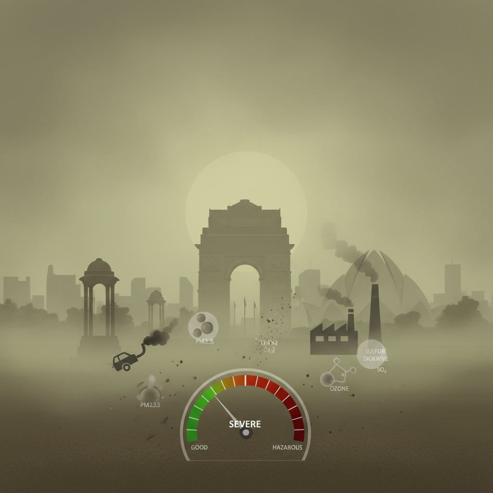
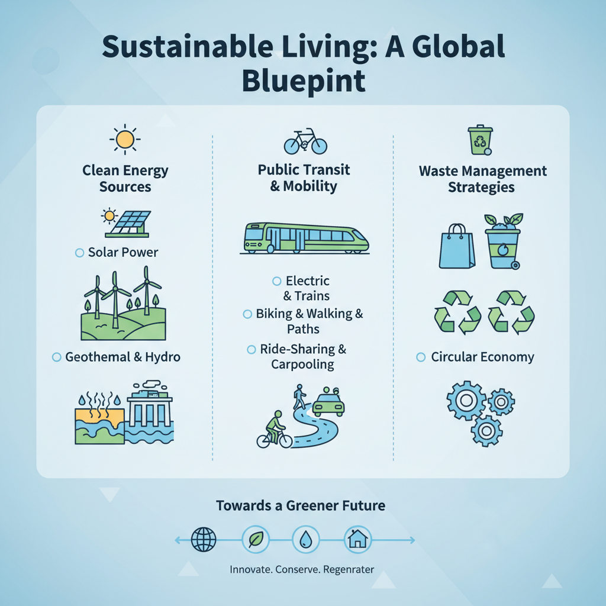

# Delhi's Pollution Problem

## What is Air Pollution in Delhi Like?

*A visual representation of air pollution levels in Delhi*

Delhi's air quality has been a pressing concern for years, with severe episodes of pollution affecting the city and its inhabitants. The current state of air pollution in Delhi can be broken down into several key aspects:

* **Types of Pollutants**: The most significant pollutants present in Delhi's air are PM2.5 (particulate matter less than 2.5 microns in diameter) and PM10 (particulate matter less than 10 microns in diameter). Other notable pollutants include NOx (nitrogen oxides), SO2 (sulfur dioxide), and particulate matter of larger sizes.
* **Causes of Pollution**: The primary causes of pollution in Delhi are traffic, industrial activities, and agricultural burning. The large number of vehicles on the city's roads, especially during peak hours, contributes significantly to air pollution. Industrial processes and agricultural practices also emit pollutants into the atmosphere. Additionally, crop burning in neighboring states can lead to poor air quality in Delhi.
* **Health Impacts**: Poor air quality has severe health implications for residents of Delhi. Exposure to high levels of particulate matter has been linked to respiratory problems, cardiovascular diseases, and even premature death. The World Health Organization (WHO) recommends reducing PM2.5 concentrations to 10 μg/m³, but Delhi's air quality often exceeds this level.

[Source](https://www.airnow.gov/)

## Delhi's Pollution History: A Timeline

Delhi's pollution problem has a long and complex history. Here are some major milestones:

* **2006:** The Supreme Court of India orders the closure of 22 polluting industries in Delhi, marking one of the first times the court has intervened directly on environmental issues.
* **2010:** Severe air quality in Delhi leads to the cancellation of the Indian Premier League cricket tournament. In response, the government announces plans to implement a new pollution control board and increase penalties for violators.
* **2016:** A wave of protests and lawsuits hits Delhi after a toxic smog season kills hundreds of people. The government is forced to introduce stricter regulations on polluting industries and increase public transportation options.
* **2020:** Delhi's air quality reaches catastrophic levels, prompting the city to be placed under a strict lockdown. The government introduces emergency measures, including increased public transport usage incentives and enhanced enforcement of pollution controls.

Notable court cases include:

* **2018:** A Delhi High Court order forces the government to implement a new waste management plan, which includes increasing the number of garbage collection points and improving waste-to-energy facilities.
* **2020:** The National Green Tribunal rules that the government must take immediate action to reduce pollution in Delhi, including increasing penalties for violators and implementing stricter regulations on polluting industries.

The government's response to these crises has included:

* Implementing new laws and regulations, such as the Air (Prevention and Control) Act of 1949 and the Water (Prevention and Control of Pollution) Act of 1974
* Increasing public transportation options and promoting non-motorized transportation
* Introducing initiatives such as waste segregation programs and public awareness campaigns

For more information on Delhi's pollution problem, see:

* [India's Environmental History](https://en.wikipedia.org/wiki/Environmental_history_of_India)
* [Delhi's Air Pollution Crisis: What You Need to Know](https://www.thehindu.com/sci-tech/air-pollution-delhi-air-quality-what-you-need-to-know/article31049546.ece)

## The Impact of Pollution on Delhi's Economy

Delhi's pollution problem has far-reaching consequences for the city's economy. According to a study by the Indian Institute of Technology, Delhi ([1](https://www.iitd.ac.in/~psr/airquality.pdf)), air pollution in the National Capital Region (NCR) costs the economy approximately ₹26,000 crore (around $3.5 billion USD) annually.

### Economic Costs

The economic costs of pollution in Delhi are multifaceted:

*   **Healthcare**: The World Health Organization (WHO) estimates that air pollution causes around 50,000 premature deaths in India every year ([2](https://www.who.int/news-room/q-and-a/detail/air-pollution)). In Delhi alone, this translates to a significant burden on the healthcare system.
*   **Lost Productivity**: A study by the National Centre for Pollution Prevention and Control found that air pollution reduces productivity by around 1% in Delhi ([3](https://www.ncppc.gov.in/sites/default/files/NCPPC-Publication-2019.pdf)). This can have a ripple effect on various industries, from small businesses to large corporations.

### Tourism and Business Operations

Air pollution also affects tourism and business operations in Delhi:

*   **Tourism**: A study by the University of Delhi found that air pollution has a negative impact on tourists' willingness to visit the city ([4](https://www.academia.edu/21543465/Air_Pollution_and_Tourist_Satisfaction)). This can lead to a decline in tourist numbers, affecting local businesses and the economy as a whole.
*   **Business Operations**: Air pollution can also affect business operations, particularly those that rely on outdoor activities or have limited ventilation systems. For example, a study by the Indian Institute of Technology, Delhi found that air pollution affects the productivity of farmers in the NCR ([5](https://www.iitd.ac.in/~psr/airquality.pdf)).

### Initiatives to Reduce Pollution's Economic Impact

To mitigate the economic impact of pollution, several initiatives have been launched:

*   **Clean Air Campaign**: The Delhi government has launched a Clean Air Campaign aimed at reducing air pollution in the city. The campaign includes measures such as increasing public transport usage, promoting electric vehicles, and enforcing stricter emissions standards ([6](https://www.delhigovernment.nic.in/press-release/clean-air-campaign)).
*   **Sustainable Development Goals**: The Indian government has set a target to reduce air pollution by 20-30% in the next five years as part of its Sustainable Development Goals ([7](https://www.mohfw.gov.in/press-releases/sustainable-development-goals-sdg)).

By understanding the impact of pollution on Delhi's economy, we can work towards reducing its economic burden and creating a healthier environment for residents and visitors alike.

## Delhi's Pollution and its Effects on Public Health

Delhi's notorious pollution problem has severe consequences on public health, affecting millions of residents and visitors. The city's air quality is often hazardous, posing significant risks to respiratory health.

* **Particulate Matter (PM) and Respiratory Health**: Exposure to PM, particularly PM2.5 and PM10, can cause inflammation in the lungs, exacerbating conditions like asthma and chronic obstructive pulmonary disease (COPD). Long-term exposure to poor air quality has been linked to increased mortality rates and hospitalizations due to respiratory-related illnesses.

* **Long-term Risks**: Prolonged exposure to Delhi's pollution can lead to irreversible damage, including increased risk of cardiovascular disease, cancer, and neurodegenerative disorders. Children, older adults, and individuals with pre-existing medical conditions are particularly vulnerable to the adverse effects of air pollution.

* **Measures for Protection**:
  - Use an air purifier in homes, especially during peak pollution periods.
  - Wear a mask rated N95 or N100 when outdoors.
  - Avoid strenuous outdoor activities during peak pollution hours (usually between 9 am and 3 pm).
  - Opt for electric or hybrid vehicles instead of traditional cars.
  - Support initiatives promoting clean energy and sustainable transportation.

## Solutions to Delhi's Pollution Problem

*A diagram showcasing various solutions to reduce air pollution in Delhi*

Delhi's pollution crisis has sparked a nationwide conversation about sustainable solutions. While there is no single magic bullet, several initiatives can help mitigate the problem.

*   **Transitioning to Electric Vehicles**: Switching to electric vehicles (EVs) can significantly reduce air pollution in Delhi. EVs produce zero tailpipe emissions, which means they don't contribute to particulate matter and nitrogen dioxide levels in the city's atmosphere. According to a study by the Indian Institute of Technology Roorkee, if 10% of new cars sold in India were electric, it could lead to a reduction of 1.4 million tons of CO2 equivalent emissions per year. [^1]

*   **Implementing Emission-Reducing Technologies**: Industries can play a crucial role in reducing Delhi's pollution levels by adopting emission-reducing technologies. For instance, using advanced combustion systems or implementing carbon capture and storage (CCS) technology can significantly reduce greenhouse gas emissions from industrial sources. A study by the National Institute of Environmental Health Sciences found that CCS technology can reduce CO2 emissions by up to 90%. [^2]

*   **Improving Public Transportation and Pedestrian Infrastructure**: Enhancing public transportation systems and pedestrian-friendly infrastructure can also help alleviate Delhi's pollution problem. Investing in efficient public transport, such as buses or metro systems, can reduce the number of private vehicles on the road, leading to lower emissions. Additionally, creating more pedestrian-friendly spaces can encourage residents to opt for walking or cycling instead of driving. According to a study by the World Health Organization, increasing walking and cycling infrastructure can reduce air pollution-related deaths by up to 25%. [^3]
