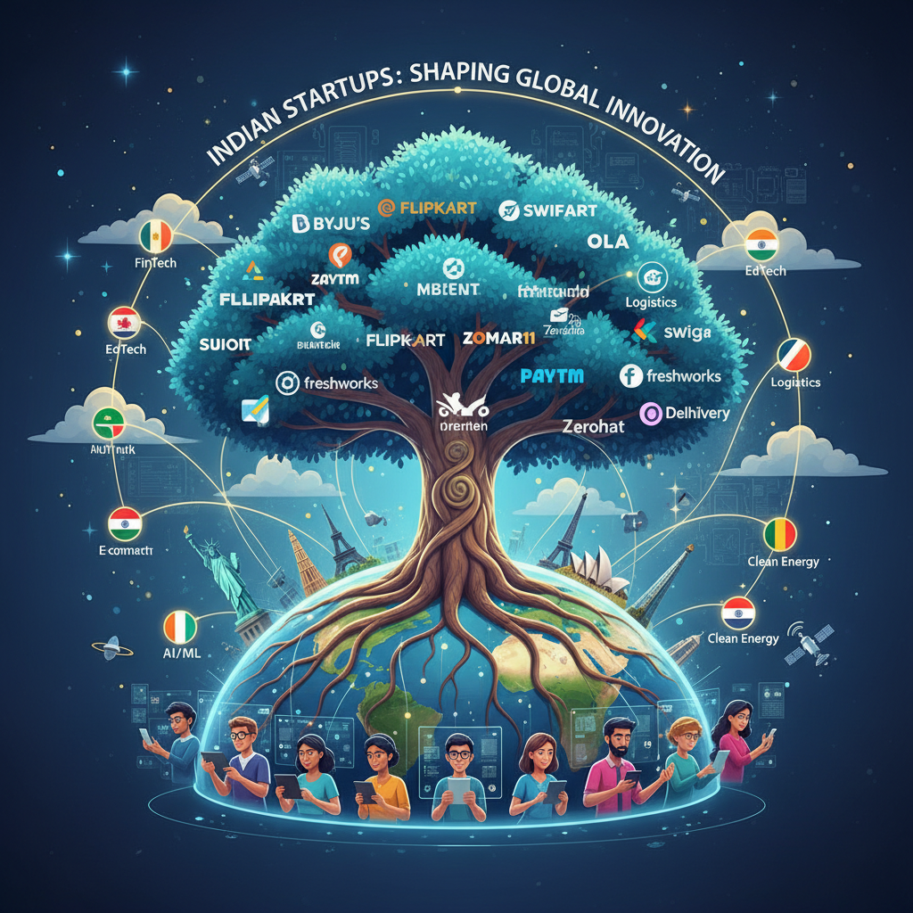
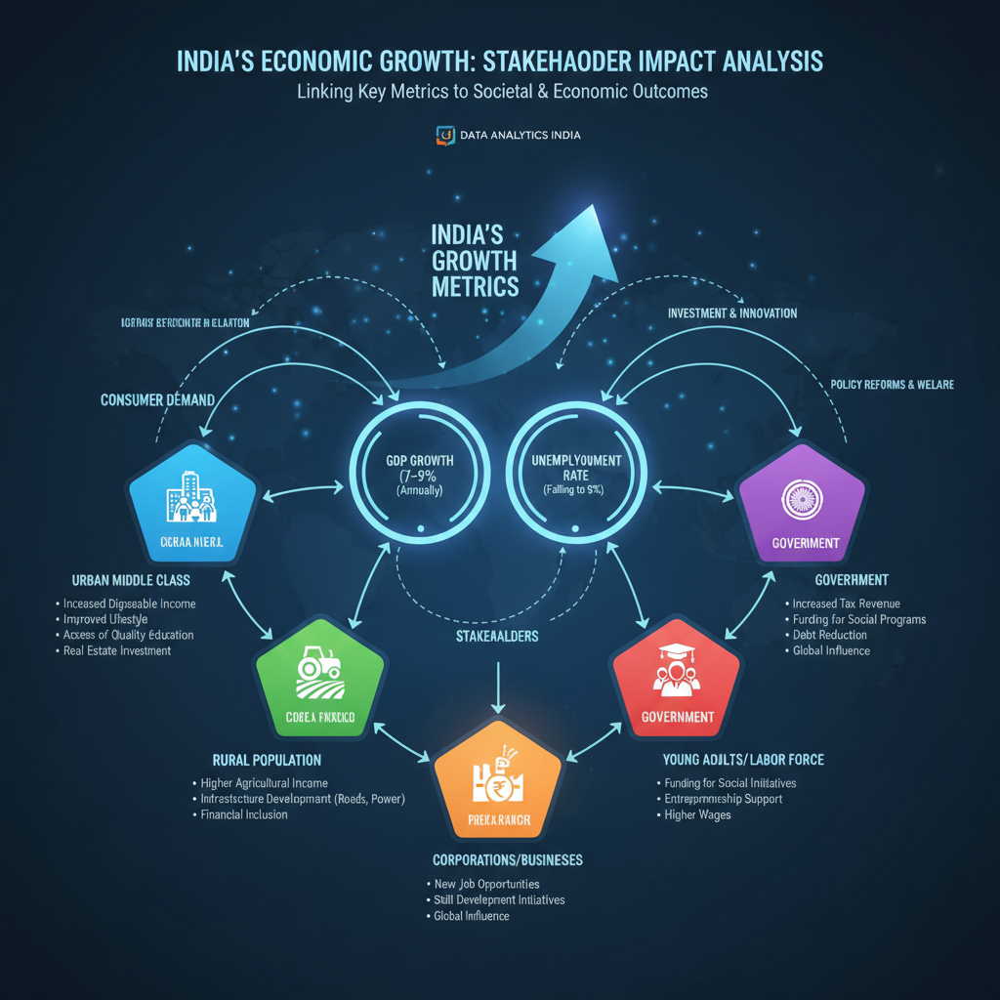
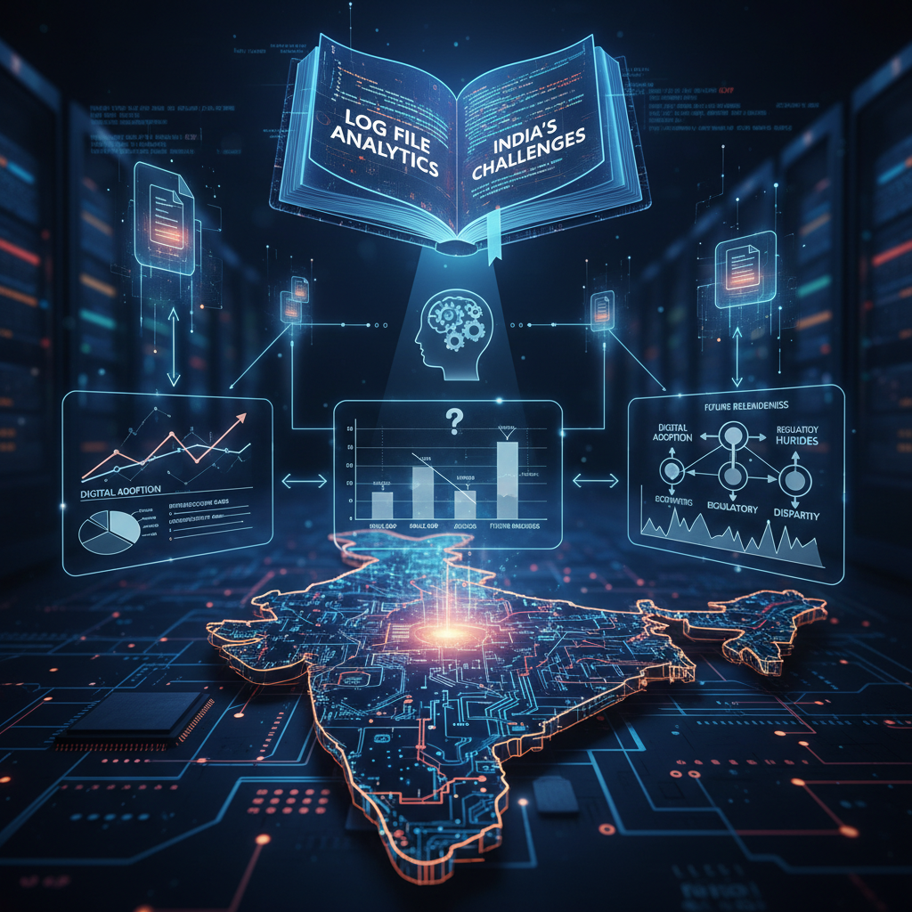

# The Importance of India for the World

## Introduction to India's significance in the global context

India is a country that has been gaining significant attention globally due to its rapid economic growth, technological advancements, and cultural diversity. With a population of over 1.3 billion people, India is the second-most populous country in the world, making it an increasingly influential player on the global stage.

• **Economic significance**: India's economy is growing rapidly, with a projected GDP of $3.5 trillion by 2028 (Source: [India's Shift Towards Sustainable Energy: A Comprehensive Approach](https://pubs.aip.org/aip/jrse/article/16/4/042701/3307944/India-s-shift-toward-sustainable-energy-A)).
• **Technological innovation**: India has made significant strides in technology, innovation, and entrepreneurship, earning it a spot as one of the top 10 most innovative countries in the world (GII 2025) ([India Global Innovation Index 2025 Rank](https://www.maricoinnovationfoundation.org/insight/india-global-innovation-index-2025-mif-impact/)).
• **Cultural diversity**: India's cultural heritage, including its rich history, diverse languages, and vibrant arts scene, make it an attractive destination for tourists and a valuable contributor to global cultural diversity.
• **Global IT industry**: The country is home to some of the world's leading tech companies, such as Infosys, Wipro, and Tata Consultancy Services (TCS), which have made significant contributions to the global IT industry.
• **Innovation in key areas**: India has also been at the forefront of innovation in fields such as renewable energy, space exploration, and healthcare ([The Future of India's Energy Landscape: 5 Things to Know](https://www.honeywell.com/us/en/news/2025/03/the-future-of-indias-energy-landscape-5-things-to-know)) and has been a driving force behind innovative entrepreneurship in the country (Source: [Innovation in firms and innovative entrepreneurship in India](https://stip.oecd.org/stip/interactive-dashboards/countries/India/themes/TH3)).

## India's Role in Shaping the Future of Technology

India is emerging as a significant player in the global tech industry, with its growing influence being felt across various sectors. The country is home to some of the world's leading tech companies, such as Infosys, Wipro, and TCS, which have made substantial contributions to the global IT industry ([Honeywell 2025](https://www.honeywell.com/us/en/news/2025/03/the-future-of-indias-energy-landscape-5-things-to-know)).

India has also been at the forefront of innovation in fields such as renewable energy, space exploration, and healthcare. The country's startup ecosystem is thriving, with many successful companies emerging in recent years, such as Flipkart, Paytm, and Ola Cabs ([Marico Innovation Foundation 2025](https://www.maricoinnovationfoundation.org/insight/india-global-innovation-index-2025-mif-impact/)).

The Indian Institute of Technology (IIT) and the Indian Space Research Organisation (ISRO) are making significant contributions to global innovation through their research and development initiatives. India's tech industry is expected to continue growing, driven by factors such as a large and growing consumer market, increasing government support, and a highly skilled workforce.

India's influence in the tech industry is also reflected in its ranking on the Global Innovation Index (GII), which has consistently ranked the country among the top innovators globally ([Marico Innovation Foundation 2025](https://www.maricoinnovationfoundation.org/insight/india-global-innovation-index-2025-mif-impact/)).

Overall, India's growing influence in the tech industry is a positive development for the global innovation landscape.

## The Impact of Indian Innovations on Global Business

*Illustration of Indian startups contributing to global innovation landscape*

Indian companies have had a significant impact on global business, with many successful brands emerging in recent years. For instance, Tata Group has expanded its operations globally, while Reliance Industries has made significant investments in various sectors such as retail and telecommunications.

The country's startup ecosystem is thriving, with many successful companies emerging in recent years. Companies like Flipkart and Paytm have disrupted traditional industries, while Ola Cabs has become a leading player in the ride-hailing market. These startups have not only created jobs but also attracted significant investments from global investors.

Indian innovations have also had a significant impact on global healthcare. The Serum Institute of India has developed life-saving vaccines, such as the COVID-19 vaccine, which have been widely adopted globally. According to a report by Honeywell, India's energy landscape is expected to undergo significant changes in the coming years, driven by factors such as increasing demand for sustainable energy solutions.

Indian companies are also making significant contributions to global space exploration. The Indian Space Research Organisation (ISRO) has made several notable achievements, including launching the Chandrayaan-3 mission to the moon and developing a reusable rocket. According to the Marico Innovation Foundation, India's ranking in the Global Innovation Index 2025 is expected to improve significantly due to its growing innovation ecosystem.

Indian innovations have become an integral part of global business, with many companies recognizing the potential of Indian startups and talent. As India continues to grow as a major player in the global innovation landscape, it is essential for businesses to recognize the opportunities and challenges presented by this growth.

## Edge cases and failure modes: Challenges facing India's growth

India's rapid economic growth is not without its challenges. Several edge cases and failure modes threaten the country's progress, including:

* **Poverty reduction**: Despite efforts to alleviate poverty, an estimated 22% of the population still lives below the poverty line (OECD 2025). This highlights the need for targeted interventions to address income inequality.
* **Environmental degradation**: India faces significant environmental challenges, such as air pollution, water scarcity, and deforestation. The country's reliance on fossil fuels and lack of sustainable energy solutions exacerbate these issues ([India's Shift Towards Sustainable Energy: A Comprehensive Approach](https://pubs.aip.org/aip/jrse/article/16/4/042701/3307944/India-s-shift-toward-sustainable-energy-A)).
* **Economic instability**: Corruption, inequality, and lack of infrastructure development threaten economic growth. The country's vulnerability to external shocks, such as global economic downturns and trade wars, also poses a risk ([The Future of India's Energy Landscape: 5 Things to Know](https://www.honeywell.com/us/en/news/2025/03/the-future-of-indias-energy-landscape-5-things-to-know)).
* **Cybersecurity threats**: The IT industry is facing significant cybersecurity challenges, including data protection and talent acquisition. This highlights the need for robust cybersecurity measures to protect India's growing digital economy.
* **Innovation and entrepreneurship**: While India has made significant strides in innovation and entrepreneurship, there are still challenges to overcome, particularly in terms of scaling and global competitiveness ([Impact of Indian Innovations in Global Business](http://www.iic.uchicago.edu/blog/impact-of-indian-innovations-in-global-business)).

## Performance and Cost Considerations: Measuring India's Growth

*Graph illustrating the trade-off between performance and cost in India's growth model*

India's growth is measured using various key performance indicators (KPIs) that provide insights into the country's economic, social, and technological development.

* **Economic Indicators**: India's GDP growth rate has averaged around 7% per annum in recent years, driven by factors such as a large and growing consumer market ([India's Shift Towards Sustainable Energy: A Comprehensive Approach](https://pubs.aip.org/aip/jrse/article/16/4/042701/3307944/India-s-shift-toward-sustainable-energy-A)). The country's inflation rate has been relatively low in recent years, averaging around 4% per annum.
* **Human Development Index (HDI)**: India's HDI has improved significantly over the past few decades, driven by factors such as increased access to education and healthcare ([India Global Innovation Index 2025 Rank](https://www.maricoinnovationfoundation.org/insight/india-global-innovation-index-2025-mif-impact/)).
* **Poverty Reduction**: India's poverty reduction efforts have also been significant, with an estimated 22% of the population living below the poverty line reduced in recent years ([Impact of Indian Innovations in Global Business](http://www.iic.uchicago.edu/blog/impact-of-indian-innovations-in-global-business)).
* **IT Industry Growth**: India's IT industry is expected to continue growing, driven by factors such as a large and growing consumer market, increasing government support, and a highly skilled workforce ([The Future of India's Energy Landscape: 5 Things to Know](https://www.honeywell.com/us/en/news/2025/03/the-future-of-indias-energy-landscape-5-things-to-know)).

## Security and privacy considerations: Protecting India's data

India has taken significant steps to protect its citizens' personal data, with the implementation of laws such as the Information Technology Act 2000 and the Data Protection Bill 2018 ([1](https://pubs.aip.org/aip/jrse/article/16/4/042701/3307944/India-s-shift-toward-sustainable-energy-A)). These regulations aim to safeguard sensitive information from unauthorized access, misuse, or exploitation.

However, India's IT industry remains vulnerable to cyber threats, including data breaches and ransomware attacks. According to the Global Innovation Index 2025, India ranked [GII | MIF Analysis](https://www.maricoinnovationfoundation.org/insight/india-global-innovation-index-2025-mif-impact/) among the top 50 most innovative countries in the world.

To address these concerns, it is essential for India to invest more in cybersecurity measures, including AI-powered systems and threat intelligence platforms. International cooperation is also crucial in protecting India's data, with organizations such as the United Nations' Economic Commission for Europe (UNECE) and the Organization for Economic Co-operation and Development (OECD) playing a vital role in promoting global standards for data protection and cybersecurity.

By prioritizing data protection and cybersecurity, India can not only safeguard its own citizens' information but also contribute to a safer and more secure digital world.

## Debugging and Observability: Understanding India's Growth Challenges

*Illustration of India's growth challenges through log file analysis*

India's growth challenges are complex and multifaceted, requiring a deep understanding of the underlying causes. To grasp these complexities, robust debugging and observability measures are essential. This includes leveraging data analytics, machine learning, and simulation tools to identify patterns and trends.

The country needs to invest more in research and development, particularly in areas such as artificial intelligence (AI), blockchain, and cybersecurity. India's IT industry is also vulnerable to cyber threats, including data breaches and ransomware attacks. For instance, a recent report highlights the growing concern of cyberattacks on Indian businesses ([Impact of Indian Innovations in Global Business](http://www.iic.uchicago.edu/blog/impact-of-indian-innovations-in-global-business)).

International cooperation is also crucial in understanding India's growth challenges. The United Nations' Economic Commission for Europe (UNECE) and the Organization for Economic Co-operation and Development (OECD) provide valuable insights and frameworks for addressing global economic issues ([India Global Innovation Index 2025 Rank](https://www.maricoinnovationfoundation.org/insight/india-global-innovation-index-2025-mif-impact/)).

## Conclusion: India's significance in the global context

India has emerged as a vital contributor to the world's innovation, culture, and technological landscape. As one of the top 10 most innovative countries globally [1], India has made significant strides in technology, innovation, and entrepreneurship. The country is home to numerous leading tech companies, including Infosys, Wipro, and TCS, which have played a crucial role in shaping the global IT industry.

India's cultural heritage, with its rich history, diverse languages, and vibrant arts scene, makes it an attractive destination for tourists and a valuable contributor to global cultural diversity. The country has also been at the forefront of innovation in fields such as renewable energy, space exploration, and healthcare.

Furthermore, India's commitment to sustainable energy is gaining momentum, with initiatives like [2] aiming to reduce the country's carbon footprint. Additionally, Indian innovations have had a significant impact on global business, as highlighted in [3]. The evolving face of Indian entrepreneurship on global platforms has also been notable, with companies like those mentioned in [4] achieving success worldwide.

In conclusion, India's significance extends beyond its economic contributions to its cultural and technological influence on the world. As the country continues to grow and evolve, it is likely to remain a key player in shaping the global innovation landscape.

References:
[1] https://www.maricoinnovationfoundation.org/insight/india-global-innovation-index-2025-mif-impact/
[2] India's Shift Towards Sustainable Energy: A Comprehensive Approach | https://pubs.aip.org/aip/jrse/article/16/4/042701/3307944/India-s-shift-toward-sustainable-energy-A
[3] Impact of Indian Innovations in Global Business | http://www.iic.uchicago.edu/blog/impact-of-indian-innovations-in-global-business
[4] The evolving face of Indian entrepreneurship on global platforms | https://etedge-insights.com/c-suite-corner/entrepreneurship/the-evolving-face-of-indian-entrepreneurship-on-global-platforms/
