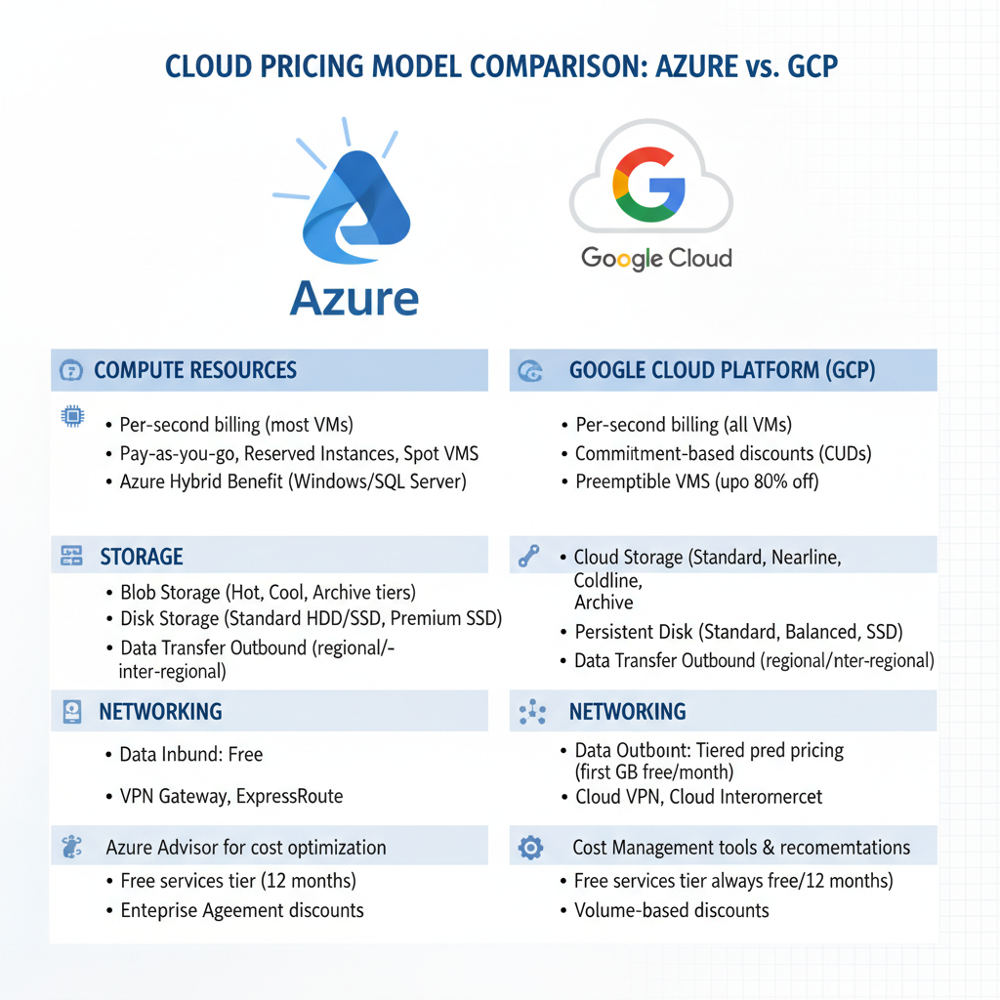
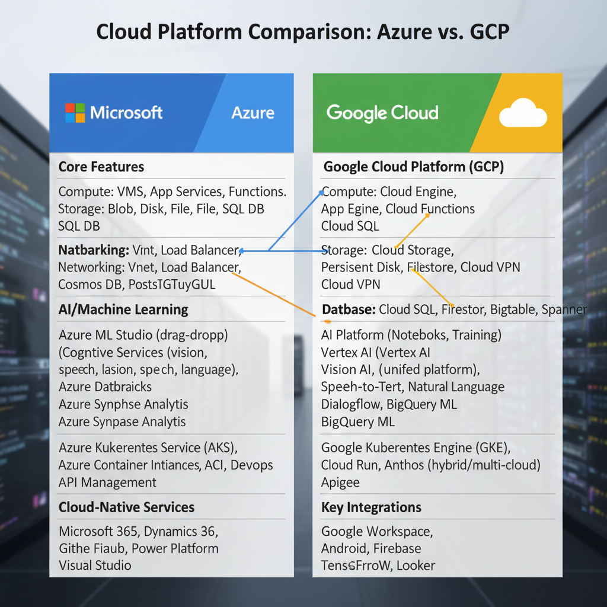
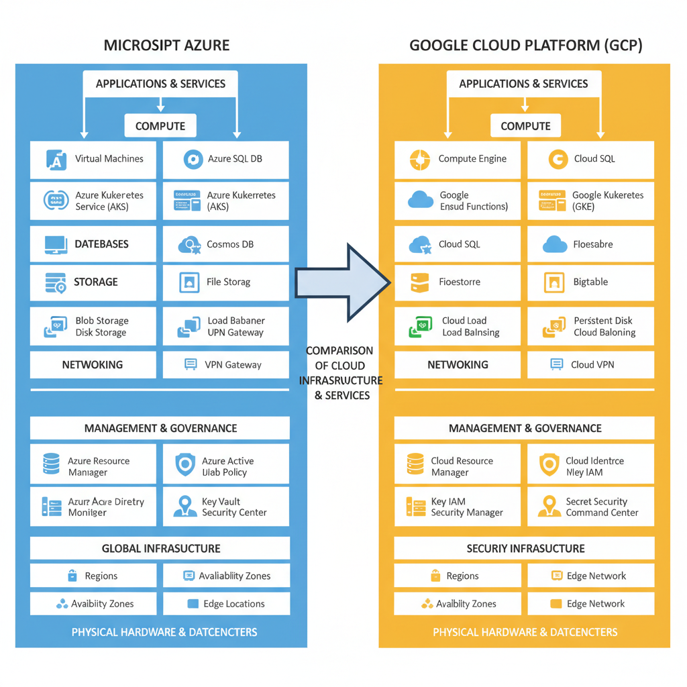

# Understanding the Differences between Azure and GCP

## What are the Strategic Focuses of Azure and GCP?

When it comes to cloud computing, both Microsoft's Azure and Google Cloud Platform (GCP) have distinct strategic focuses that set them apart from one another. Here are some key differences:

* **Integration with the Microsoft ecosystem**: Azure is deeply integrated with other Microsoft products and services, such as Visual Studio, Azure DevOps, and Microsoft 365. This integration provides a seamless experience for developers who use these tools in their daily work. On the other hand, GCP has limited integration with non-Google products.
* **Big data analytics and container-native networking**: GCP excels in big data analytics and container-native networking. Its Bigtable and Cloud Spanner databases are designed to handle massive amounts of data, while its Kubernetes-based container networking provides a robust and scalable environment for containerized applications. Azure also offers these services, but GCP's offerings are generally considered more comprehensive.
* **Granular infrastructure control**: In terms of granular infrastructure control, AWS is often considered the leader in this area. While both Azure and GCP offer more control over their respective infrastructures, AWS provides a wider range of options for customizing and managing resources at the most detailed level.

It's worth noting that while these differences are significant, they also depend on your specific needs and use case. Ultimately, choosing between Azure and GCP depends on your organization's unique requirements and preferences.

## Comparison of Pricing Models

*A side-by-side comparison of the pricing models for Azure and GCP.*

When it comes to choosing between Azure and Google Cloud Platform (GCP) for your cloud infrastructure needs, understanding the pricing models is crucial. While both offer competitive pricing, there are notable differences in their approaches.

* **Compute Optimized Instances**: GCP offers the highest price for compute optimized instances compared to other cloud providers. According to a study by Cast AI, [Google Cloud Platform](https://cast.ai/blog/cloud-pricing-comparison/) has the most expensive instance types, making it less suitable for large-scale applications or those requiring high-performance computing.
* **Pricing Flexibility**: Azure's pricing model is more flexible across almost all cloud services. This flexibility allows developers to better predict and manage their costs. A comprehensive guide by Medium highlights this advantage, stating that "Azure's pricing model is generally more transparent and easier to understand" ([Microsoft Azure vs Google Cloud Platform: A Comprehensive Guide](https://medium.com/@oakstreetechnologies/microsoft-azure-vs-google-cloud-platform-a-comprehensive-guide-d482fc5ca861)).
* **Cost Implications**: Choosing between Azure and GCP depends on your specific needs and budget. While GCP offers more powerful instance types, Azure's pricing flexibility may lead to lower overall costs for smaller applications or those with variable workloads. As noted by NetApp, "Azure vs Google Cloud: How They Compare" ([https://www.netapp.com/blog/azure-vs-google-cloud-how-they-compare/](https://www.netapp.com/blog/azure-vs-google-cloud-how-they-compare/)), both platforms require careful consideration of costs to ensure the best fit for your organization.

## Key Features and Integrations

*A side-by-side comparison of the key features and integrations offered by Azure and GCP.*

When choosing between Azure and GCP, several key features and integrations can significantly impact your decision. Here are some of the most notable differences:

* **Integration with development tools**: Azure has tight integration with Visual Studio Code (VS Code), allowing for seamless deployment, debugging, and collaboration. This makes it an excellent choice for developers already familiar with VS Code.
* **Open-source support**: GCP supports open-source solutions through its compatibility with Kubernetes, making it a popular choice for containerized applications. However, this also means that GCP may not offer the same level of control over container management as Azure.
* **Cost and pricing**: According to Cast AI, both Azure and GCP offer competitive pricing models, but Azure is generally more transparent about its costs ([Cast AI](https://cast.ai/blog/cloud-pricing-comparison/)). However, it's essential to note that the cost of using these platforms can vary significantly depending on your specific use case.

In terms of choosing one over the other for specific use cases:

* **Enterprise environments**: Azure may be a better fit due to its strong focus on enterprise security and management features.
* **Containerized applications**: GCP's support for Kubernetes makes it an excellent choice for containerized workloads.
* **Machine learning and AI**: Both platforms offer robust ML and AI services, but Azure's Azure Machine Learning and GCP's AutoML are often considered industry leaders.

Ultimately, the choice between Azure and GCP depends on your specific needs and requirements. It's recommended to weigh these factors carefully before making a decision.

## Edge Cases and Failure Modes

When choosing between Azure and GCP, it's essential to consider the potential edge cases and failure modes that can impact your application. Here are some key differences to be aware of:

* **Azure Managed Identity Implications**: Using Azure's managed identity feature can have significant implications for security and compliance. According to DigitalOcean ([1](https://www.digitalocean.com/resources/articles/comparing-aws-azure-gcp)), managed identities can reduce the administrative burden, but also introduce new risks if not properly configured. It's crucial to understand how managed identities interact with your application's identity management strategy.
* **GCP Auto-Scaling Performance Impact**: GCP's auto-scaling feature can impact performance in certain scenarios. As noted by Cast AI ([2](https://cast.ai/blog/cloud-pricing-comparison/)), auto-scaling can lead to increased latency and decreased responsiveness if not properly tuned. It's essential to monitor your application's performance and adjust auto-scaling settings accordingly.
* **Failure Mode Response**: In case of a failure mode, it's crucial to have a clear plan in place. According to NetApp ([4](https://www.netapp.com/blog/azure-vs-google-cloud-how-they-compare/)), having a well-defined disaster recovery strategy can help minimize downtime and data loss. Microsoft Azure vs Google Cloud Platform: A Comprehensive Guide ([3](https://medium.com/@oakstreetechnologies/microsoft-azure-vs-google-cloud-platform-a-comprehensive-guide-d482fc5ca861)) provides valuable insights into disaster recovery best practices for both platforms.

By understanding these edge cases and failure modes, you can better prepare your application for the unique challenges of each cloud platform.

## Security and Compliance Considerations

When evaluating cloud providers for security and compliance, it's essential to understand the differences between Azure and GCP. Here are some key considerations:

*   **Azure Encryption at Rest**: Azure provides a robust encryption at rest feature that ensures data is protected from unauthorized access. The feature uses a combination of customer-managed keys and server-side encryption to safeguard data. According to DigitalOcean, "Azure's encryption at rest uses AES-256-bit encryption, which is widely considered secure" ([DigitalOcean](https://www.digitalocean.com/resources/articles/comparing-aws-azure-gcp)).
*   **GCP Data Loss Prevention**: GCP's data loss prevention feature helps prevent sensitive data from being transmitted or stored in unauthorized locations. However, this feature can impact compliance with certain regulatory requirements. As noted by Cast AI, "GCP's data loss prevention feature can be a double-edged sword" ([Cast AI](https://cast.ai/blog/cloud-pricing-comparison/)).
*   **Regulatory Compliance**: When choosing between Azure and GCP, it's crucial to consider the specific regulatory requirements of your organization. For example, Azure offers more comprehensive compliance certifications than GCP, including ISO 27001 and SOC 2 ([Microsoft Azure vs Google Cloud Platform: A Comprehensive Guide](https://medium.com/@oakstreetechnologies/microsoft-azure-vs-google-cloud-platform-a-comprehensive-guide-d482fc5ca861)). In contrast, GCP's compliance offerings are more limited, although it does offer some certifications like ISO 27001 and SOC 2 ([Azure vs Google Cloud: How They Compare - NetApp](https://www.netapp.com/blog/azure-vs-google-cloud-how-they-compare/)).

Ultimately, the choice between Azure and GCP for security and compliance depends on your organization's specific needs and requirements. By understanding the strengths and weaknesses of each provider, you can make an informed decision that meets your organization's unique demands.

## Debugging and Observability Tips for Azure and GCP

As developers, we're constantly working with complex systems that require careful monitoring to ensure smooth operation. Both Azure and GCP offer robust debugging and observability tools, but understanding how to use them effectively can be daunting. Here are some tips to get you started:

*   **Azure Monitor**: Use Azure Monitor to troubleshoot issues by setting up logging and performance metrics for your applications. This allows you to track key performance indicators (KPIs) such as latency, error rates, and CPU utilization.
    *   [Learn more about Azure Monitor](https://www.digitalocean.com/resources/articles/comparing-aws-azure-gcp#azure-monitor)
*   **GCP's Cloud Logging**: Leverage GCP's Cloud Logging feature to help with debugging by setting up log collection and filtering. This enables you to track specific logs, filter out noise, and gain insights into application performance.
    *   [Explore Cloud Logging](https://www.google.com/cloud/ logging)
*   **Logging and Monitoring Tools**: The importance of using logging and monitoring tools cannot be overstated. By implementing these tools, you can identify issues before they become major problems, reducing downtime and improving overall system reliability.

By following these tips and leveraging the debugging and observability features offered by Azure and GCP, you'll be better equipped to manage complex systems and ensure seamless application performance.

*A visual representation of the architecture differences between Azure and GCP.*