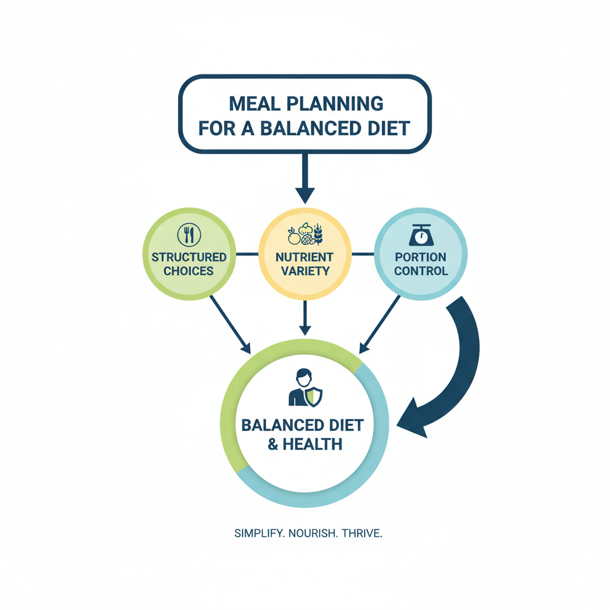
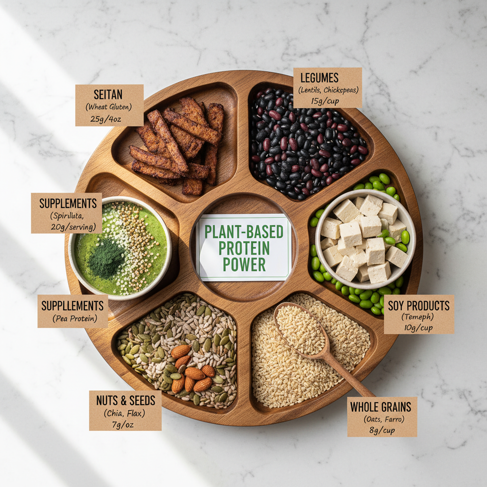
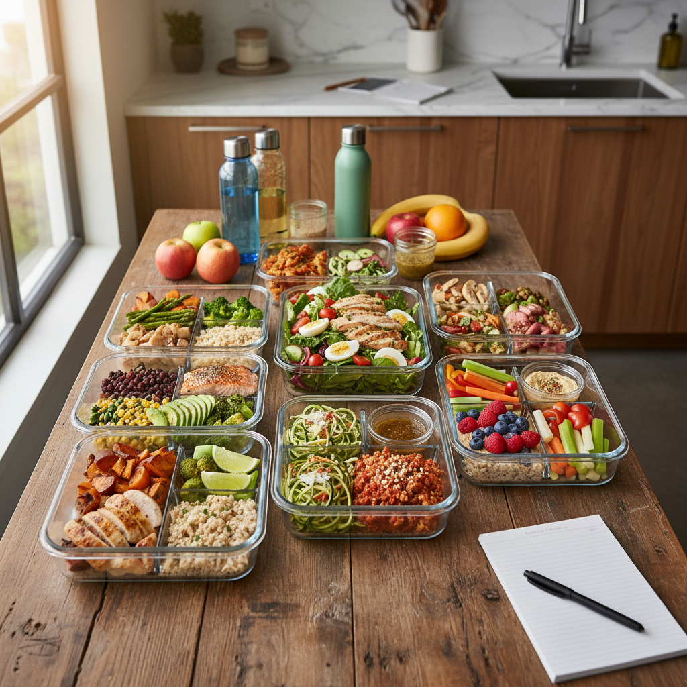

# Health-Conscious Meal Planning: Tips and Tricks

## Understanding the Importance of Meal Planning for a Healthy Diet

*A simple diagram illustrating the importance of meal planning in maintaining a healthy diet.*

Meal planning is a crucial aspect of maintaining a healthy diet, and its benefits extend far beyond just eating well. By incorporating meal planning into your daily routine, you can significantly impact your overall health and wellbeing.

*   **Weight Management**: Meal planning helps in creating a balanced diet that meets your nutritional needs, reducing the likelihood of overeating or making unhealthy food choices. This, in turn, can lead to weight loss and maintenance.
*   **Reducing Healthcare Costs**: A well-planned meal plan can help prevent chronic diseases such as diabetes and hypertension by managing blood sugar levels and blood pressure. By avoiding these conditions, you can significantly reduce your healthcare costs over time.

**Considering Individual Nutritional Needs and Dietary Restrictions**

When it comes to meal planning, it's essential to consider your individual nutritional needs and dietary restrictions. This includes:

*   **Allergies and Intolerances**: Identifying common allergens such as nuts, dairy, or gluten can help you create a safe and healthy meal plan.
*   **Vegan and Vegetarian Diets**: If you're following a plant-based diet, it's crucial to ensure that your meals are rich in protein and other essential nutrients. The best plant-based protein sources include beans, lentils, tofu, tempeh, and seitan.
*   **Low-Carb Diets**: For those following a low-carb diet, meal planning can help you stay on track by providing healthy breakfast ideas that fit within your daily carb limit.

By incorporating these principles into your meal planning routine, you can create a healthy and balanced diet that meets your individual needs and supports overall health and wellbeing.

## Best Plant-Based Protein Sources for a Health-Conscious Diet

*An infographic highlighting various plant-based protein sources.*

When it comes to incorporating plant-based protein sources into your diet, there are numerous options to explore. Here are some of the top plant-based protein sources and their nutritional benefits:

* **Lentils**: High in fiber, iron, and potassium, lentils are an excellent source of plant-based protein (18g per 1 cup cooked). They can be added to soups, stews, and curries for a nutritious boost.
* **Chickpeas**: Rich in protein, fiber, and various vitamins and minerals, chickpeas make a great addition to salads, stews, and hummus. One cup of cooked chickpeas provides 15g of protein.
* **Tofu**: A versatile and protein-rich option, tofu can be marinated and baked or stir-fried with vegetables for a quick and easy meal (20g of protein per 3 oz serving).
* **Tempeh**: A fermented soybean product, tempeh is high in protein, fiber, and probiotics. It can be used in place of meat in many recipes, adding a nutty flavor and 15g of protein per 3 oz serving.
* **Seitan**: Made from wheat gluten, seitan is a good source of plant-based protein (21g per 3 oz serving) and can be used in place of meat in stir-fries and stews.

To incorporate these protein sources into your diet, try the following examples:

* Add cooked lentils to a salad with mixed greens, cherry tomatoes, and a citrus vinaigrette.
* Use chickpeas as a topping for a whole grain pita stuffed with roasted vegetables and hummus.
* Marinate tofu in a mixture of soy sauce, maple syrup, and rice vinegar, then bake or stir-fry it with your favorite vegetables.

Choosing a variety of plant-based protein sources is essential to ensure optimal nutrition. Aim to include a source of protein at each meal to support overall health and well-being.

## Healthy Meal Prep Ideas for Busy Lives

*A collage of healthy meal prep ideas.*

As a health-conscious individual, meal prep can be a game-changer for saving time and promoting healthier eating. With a little creativity and planning, you can create delicious and nutritious meals that cater to your dietary needs and preferences.

Here are 5-10 healthy meal prep recipes to get you started:

* **Vegan Quinoa Bowl**: Cook quinoa, roasted vegetables, and chickpeas for a protein-packed bowl.
	+ Ingredients: quinoa, broccoli, carrots, chickpeas, avocado
	+ Cooking instructions: Preheat oven to 400°F (200°C). Roast vegetables for 20 minutes. Cook quinoa according to package instructions.
* **Keto Breakfast Burrito**: Scramble eggs, add avocado and spinach, then wrap in a low-carb tortilla.
	+ Ingredients: eggs, avocado, spinach, almond flour tortilla
	+ Cooking instructions: Scramble eggs in a pan. Add avocado and spinach. Wrap in a low-carb tortilla.
* **Salmon and Brown Rice Bowl**: Grill salmon and serve with brown rice and steamed vegetables.
	+ Ingredients: salmon, brown rice, broccoli, carrots
	+ Cooking instructions: Preheat grill to medium-high heat. Cook salmon for 4-5 minutes per side. Cook brown rice according to package instructions.

Benefits of meal prepping include:

* **Time-saving**: Prep meals in advance to save time during the week.
* **Cost-effective**: Plan and buy ingredients in bulk to reduce waste and save money.
* **Healthier options**: Control what goes into your meals, making it easier to stick to a healthy diet.

Tips for customizing meal prep plans:

* **Consider dietary needs**: Choose recipes that cater to specific diets such as vegan, keto, or gluten-free.
* **Add variety**: Include different protein sources and vegetables to keep meals interesting.
* **Make it convenient**: Prep ingredients in advance, such as chopping vegetables or cooking proteins.

By incorporating these healthy meal prep ideas into your routine, you can enjoy delicious and nutritious meals while saving time and money.

## Low-Carb Breakfast Ideas for a Keto Diet

When following a keto diet, it's essential to consider individual nutritional needs to ensure adequate protein intake and minimal carbohydrate consumption. The keto diet is not one-size-fits-all, and incorporating plant-based protein sources can be particularly challenging.

As noted in an article by Factor75, the best plant-based protein sources for vegans and vegetarians include [Best Plant-Based Protein Sources for Vegans & Vegetarians | https://www.factor75.com/eat/diet-guide/best-plant-based-protein-sources](https://www.factor75.com/eat/diet-guide/best-plant-based-protein-sources). Some high-protein options include tofu, tempeh, seitan, lentils, chickpeas, and quinoa.

For inspiration, Pinterest users have shared a vast array of healthy meal prep recipes, including low-carb breakfast ideas [Discover 230 Healthy Meal Prep Recipes and meals ideas - Pinterest | https://www.pinterest.com/eaturselfskinny/healthy-meal-prep-recipes/](https://www.pinterest.com/eaturselfskinny/healthy-meal-prep-recipes/) and 60 healthy meal prep ideas from Love and Lemons [60 Healthy Meal Prep Ideas - Recipes by Love and Lemons | https://www.loveandlemons.com/healthy-meal-prep-ideas/](https://www.loveandlemons.com/healthy-meal-prep-ideas/).

To get started with a keto breakfast, consider the following recipes:

* Keto pancakes made with almond flour and topped with butter and sugar-free maple syrup
* Scrambled eggs with spinach and avocado
* Low-carb smoothie bowl with coconut milk, protein powder, and nuts
* Keto coffee with heavy cream and coconut oil
* Breakfast skillet with sausage, bacon, and bell peppers

When customizing a low-carb breakfast plan, it's crucial to consider individual nutritional needs, dietary restrictions, and preferences. For example, individuals with gluten intolerance may need to avoid certain ingredients or opt for gluten-free alternatives.

Here are some tips for creating keto-friendly low-carb breakfasts:

* Choose whole foods like eggs, meat, fish, and vegetables
* Incorporate healthy fats like avocado, nuts, and seeds
* Limit carbohydrate-rich foods like grains, starchy vegetables, and legumes
* Use sugar-free sweeteners like stevia or erythritol
* Experiment with different spices and seasonings to add flavor without added carbs

## Debugging Common Health-Conscious Meal Planning Mistakes

When it comes to meal planning for a healthy diet, there are several common pitfalls to avoid. Here are some of the most significant mistakes and tips for avoiding them:

* **Relying too heavily on processed foods**: Processed foods can be high in unhealthy ingredients like added sugars, salt, and unhealthy fats. Instead, focus on whole, unprocessed foods like fruits, vegetables, lean proteins, and whole grains.
* **Neglecting portion control**: Eating large portions can lead to consuming more calories than needed, which can hinder weight loss efforts. Use a food scale or measuring cups to measure out your portions accurately.
* **Failing to consider individual nutritional needs and dietary restrictions**: Everyone's nutritional needs are different, and some individuals may require specific nutrients due to medical conditions or allergies. Make sure to take into account any dietary restrictions or preferences when planning meals.

To avoid these mistakes and ensure successful meal planning, try the following tips:

* Plan your meals around whole, unprocessed foods
* Use a food scale or measuring cups to measure out portions accurately
* Consider individual nutritional needs and dietary restrictions when planning meals
* Keep track of your calorie intake and adjust as needed

## Performance Considerations for Health-Conscious Meal Planning

When it comes to health-conscious meal planning, performance and cost are often overlooked considerations. However, these factors can significantly impact the effectiveness of your dietary choices.

* Discussing the impact of food choices on energy levels and athletic performance reveals that nutrient-dense foods provide sustained energy and support optimal physical function ([Best Plant-Based Protein Sources for Vegans & Vegetarians](https://www.factor75.com/eat/diet-guide/best-plant-based-protein-sources)). In contrast, processed foods often lead to energy crashes and decreased performance.
* Choosing whole, nutrient-dense foods over processed options is a cost-effective way to prioritize health. A study published on Pinterest found that healthy meal prep recipes can be prepared in large batches, reducing the need for frequent, expensive restaurant visits ([Discover 230 Healthy Meal Prep Recipes and meals ideas](https://www.pinterest.com/eaturselfskinny/healthy-meal-prep-recipes/)).
* Balancing nutritional needs with budget and time constraints requires careful planning. One strategy is to focus on high-protein, low-carb breakfasts that can be prepared quickly and affordably. For example, 14 Best Low-Carb Breakfast Recipes from Food Network offer a range of options using affordable ingredients like eggs, cheese, and vegetables ([14 Best Low-Carb Breakfast Recipes](https://www.foodnetwork.com/healthy/packages/healthy-every-week/low-carb-breakfasts)).
