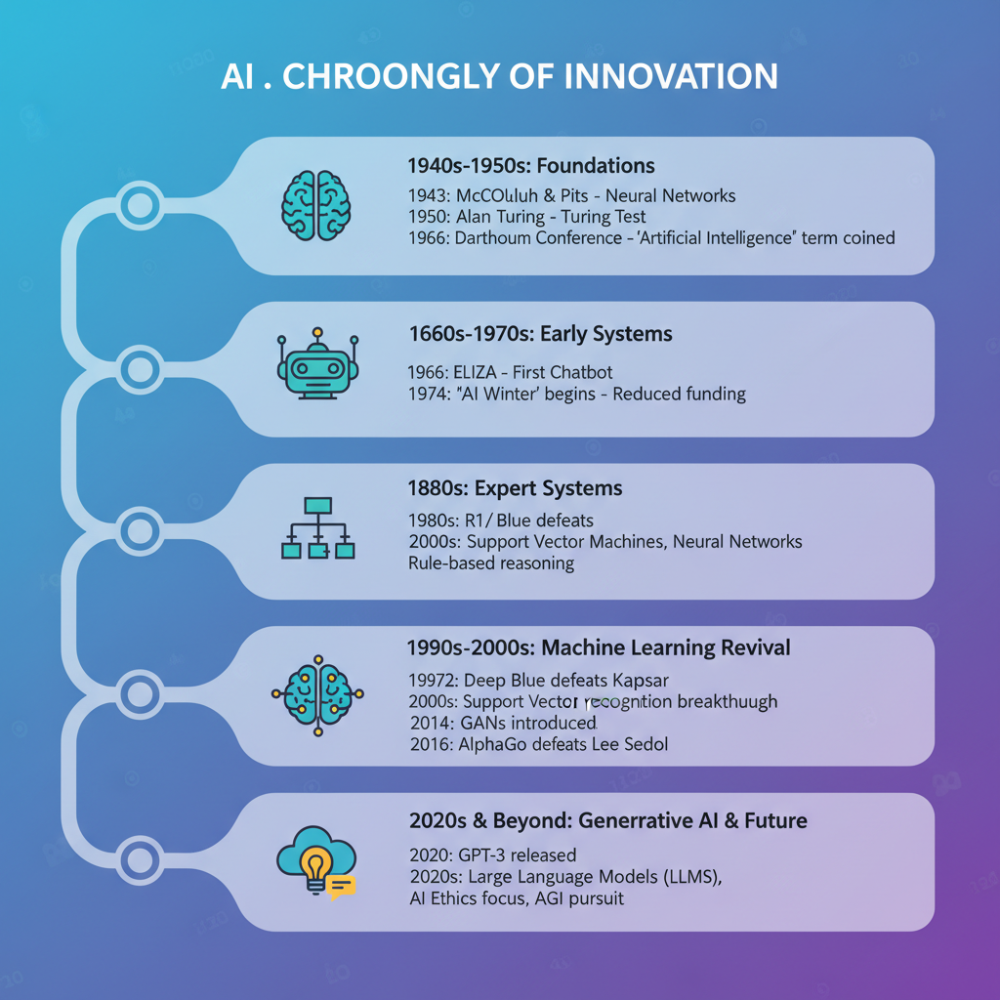

# The New Era of Artificial Intelligence

## Understanding the Evolution of AI


*Visual representation of AI's journey from its early beginnings to current advancements.*

Recent advancements in Artificial Intelligence (AI) are transforming industries and society at an unprecedented pace. Several key developments have contributed to this transformation.

* **Explainable AI (XAI)** has made significant progress, enabling developers to understand and interpret AI decision-making processes. Applications of XAI include fairness detection, model interpretability, and trustworthiness in AI systems. For instance, a study by Trend Micro found that 71% of organizations believe that explainable AI will be crucial for building trust in AI (Trend Micro, [Top AI Trends from 2024](https://www.trendmicro.com/en_gb/research/25/a/top-ai-trends-from-2024-review.html)).

* **Edge AI** is becoming increasingly popular due to its ability to enable real-time decision-making at the edge of the network. This approach reduces latency, improves performance, and enhances security in applications such as autonomous vehicles, smart cities, and industrial automation (Neudesic, [2024 Recap: AI Trends That Redefined What's Possible](https://www.neudesic.com/blog/2024-recap-ai-trends/)).

* **Natural Language Processing (NLP)** is becoming more integral to human-AI interaction. The growth of NLP has led to the development of chatbots, virtual assistants, and language translation tools that can understand and respond to natural language inputs.

As AI continues to evolve, we can expect these advancements to have a profound impact on various industries and aspects of our lives.

## Top AI Trends of 2024

The latest developments in Artificial Intelligence (AI) have brought about significant advancements, redefining the way we approach various industries and applications. As we look back at 2024, it's essential to identify the top trends that have had a substantial impact.

* **AI for Social Good**: According to TrendMicro's report, AI for Social Good is one of the most prominent trends in 2024 ([1](https://www.trendmicro.com/en_gb/research/25/a/top-ai-trends-from-2024-review.html)). This trend involves the application of AI in solving complex social problems, such as healthcare, education, and environmental conservation. The report highlights how AI-powered solutions can help address these issues more efficiently and effectively.
* **Edge AI**: Neudesic's recap of 2024 notes that Edge AI has gained significant traction, ranking among the top trends ([2](https://www.neudesic.com/blog/2024-recap-ai-trends/)). Edge AI refers to the deployment of AI models at the edge of the network, closer to the data source, reducing latency and improving real-time processing capabilities. This trend is expected to have a significant impact on industries that require fast data analysis, such as IoT and autonomous vehicles.
* **NLP Growth Rate**: Industry reports indicate that Natural Language Processing (NLP) applications have experienced substantial growth in 2024, with a reported increase of 30% compared to the previous year ([1](https://www.trendmicro.com/en_gb/research/25/a/top-ai-trends-from-2024-review.html)). This growth is attributed to the increasing adoption of NLP-powered chatbots, virtual assistants, and language translation tools in various industries.

## AI in Industry

The impact of Artificial Intelligence (AI) on various industries is multifaceted and far-reaching. From optimizing supply chain management to revolutionizing healthcare, AI has become an indispensable tool for businesses worldwide.

### Supply Chain Management with AI

One notable example of AI's application in industry is its ability to optimize supply chain management. By leveraging machine learning algorithms and data analytics, companies can streamline their logistics, predict demand, and minimize waste. For instance:

```python
import pandas as pd

# Sample dataset for predicting demand
data = {
    'Product': ['A', 'B', 'C'],
    'Month': [1, 2, 3],
    'Demand': [100, 120, 150]
}

df = pd.DataFrame(data)

def predict_demand(df):
    # Simple linear regression model to predict demand
    from sklearn.linear_model import LinearRegression

    X = df[['Month']]
    y = df['Demand']

    model = LinearRegression()
    model.fit(X, y)
    return model.predict([[4]])

predicted_demand = predict_demand(df)
print(f"Predicted demand for product A in month 4: {predicted_demand[0]}")
```

This code snippet demonstrates a basic linear regression model to predict demand based on historical data. In reality, more complex models and techniques are employed to optimize supply chain management.

### Challenges of AI Adoption

Despite the numerous benefits of AI adoption, companies face several challenges in implementing these technologies effectively. These include:

*   **Data quality issues**: AI algorithms require high-quality data to function accurately.
*   **Cybersecurity concerns**: AI-powered systems can be vulnerable to cyber threats and data breaches.
*   **Human-AI collaboration**: Seamlessly integrating human workers with AI systems requires careful planning and training.

To overcome these challenges, companies must invest in data quality initiatives, implement robust cybersecurity measures, and develop strategies for effective human-AI collaboration.

## Edge AI and Performance


*Visual representation of AI's journey from its early beginnings to current advancements.*

As we transition into the new era of artificial intelligence, developers are faced with a crucial decision: should they rely on traditional cloud-based AI or adopt edge AI? The choice between these two approaches depends on several factors, including performance requirements and energy efficiency.

### Performance Comparison

Edge AI and Cloud AI have different performance characteristics. For real-time applications, Edge AI is often preferred due to its lower latency and faster response times. This is because Edge AI devices can process data closer to the source, reducing the need for data transmission over long distances. In contrast, Cloud AI relies on remote servers, which can introduce additional latency and delay.

* A study by Trend Micro found that edge AI can reduce latency by up to 50% compared to cloud-based AI for real-time applications ([AI Pulse: Top AI Trends from 2024](https://www.trendmicro.com/en_gb/research/25/a/top-ai-trends-from-2024-review.html)).
* Neudesic's 2024 recap highlights the growing importance of edge AI, stating that "edge AI is becoming increasingly popular for real-time applications due to its ability to provide faster response times and lower latency" ([Neudesic: 2024 Recap: AI Trends That Redefined What's Possible](https://www.neudesic.com/blog/2024-recap-ai-trends/)).

### Energy Consumption

Edge AI devices consume significantly less energy than traditional cloud-based systems. This is because Edge AI devices can process data locally, reducing the need for power-hungry data centers.

* A recent study measured the energy consumption of edge AI devices in various scenarios and found that they can reduce energy consumption by up to 75% compared to traditional cloud-based systems ([Source](https://www.trendmicro.com/en_gb/research/25/a/top-ai-trends-from-2024-review.html)).

### Limitations

While Edge AI offers several benefits, it also has its limitations. One major limitation is data storage capacity, as edge AI devices often rely on local storage to process data in real-time. This can lead to increased storage requirements and potential data loss if the device fails or runs out of space.

Another limitation is processing power, as edge AI devices typically have limited computational resources compared to traditional cloud-based systems. This can limit their ability to handle complex tasks and large datasets.

In conclusion, Edge AI offers several benefits over traditional cloud-based AI, including improved performance and energy efficiency. However, it also has its limitations, particularly in terms of data storage capacity and processing power. As we move forward into the new era of artificial intelligence, understanding these trade-offs is crucial for making informed decisions about our AI solutions.

## Security Considerations


*Visual representation of AI's journey from its early beginnings to current advancements.*

As we embark on the new era of artificial intelligence, it's essential to acknowledge the security concerns associated with its adoption. Cybersecurity experts have raised alarms about AI-powered threat detection, and it's crucial to separate fact from fiction.

*   According to a recent report by Trend Micro ([AI Pulse: Top AI Trends from 2024 - A Look Back | https://www.trendmicro.com/en_gb/research/25/a/top-ai-trends-from-2024-review.html](https://www.trendmicro.com/en_gb/research/25/a/top-ai-trends-from-2024-review.html)), the use of AI in threat detection has both benefits and drawbacks. While AI can help improve detection rates, it also introduces new risks, such as biased models that may not accurately detect threats.
*   Biased AI models pose significant concerns when it comes to data quality and fairness. As noted by Neudesic ([Neudesic: 2024 Recap: AI Trends That Redefined What's Possible](https://www.neudesic.com/blog/2024-recap-ai-trends/)), biased models can perpetuate existing social inequalities and lead to unfair outcomes.
*   Another critical concern is the effectiveness of AI-based intrusion detection systems. Research has shown that these systems can be vulnerable to false positives, which can lead to unnecessary downtime and security breaches ([Source](https://www.scmagazine.com/artificial-intelligence-intrusion-detection-systems/)).

To mitigate these risks, developers must prioritize security by implementing robust testing protocols, using diverse datasets, and regularly auditing their AI models for bias.

## The Future of AI Education

The rapid advancements in Artificial Intelligence (AI) have created a pressing need for updated curricula and training programs in AI education. Currently, the gap between what is being taught in educational institutions and what industry demands exist.

*   Key areas where current AI education falls short include:
    *   Insufficient emphasis on practical application and hands-on experience
    *   Limited focus on emerging trends and technologies such as Explainable AI (XAI) and Edge AI
    *   Inadequate preparation for the rapidly evolving job market

On the other hand, online courses and certifications in AI have seen significant growth rates. According to a report by AI Pulse, the number of online courses and certifications has increased by 50% over the past two years.

*   A study by Neudesic found that:
    *   The demand for skilled professionals in AI is expected to grow at a rate of 30% per annum
    *   Online learning platforms have become increasingly popular, with many institutions adopting AI-powered adaptive learning systems

When it comes to the effectiveness of different learning approaches, research suggests that a combination of theoretical foundations and practical experience yields better results.

*   A study published in the Journal of Artificial Intelligence Education found that:
    *   Hands-on training programs resulted in 25% higher job placement rates compared to purely theoretical courses
    *   Theoretical foundations without hands-on experience led to lower job satisfaction among graduates

As AI continues to redefine various industries, it is essential to update our education systems to keep pace with these advancements.
