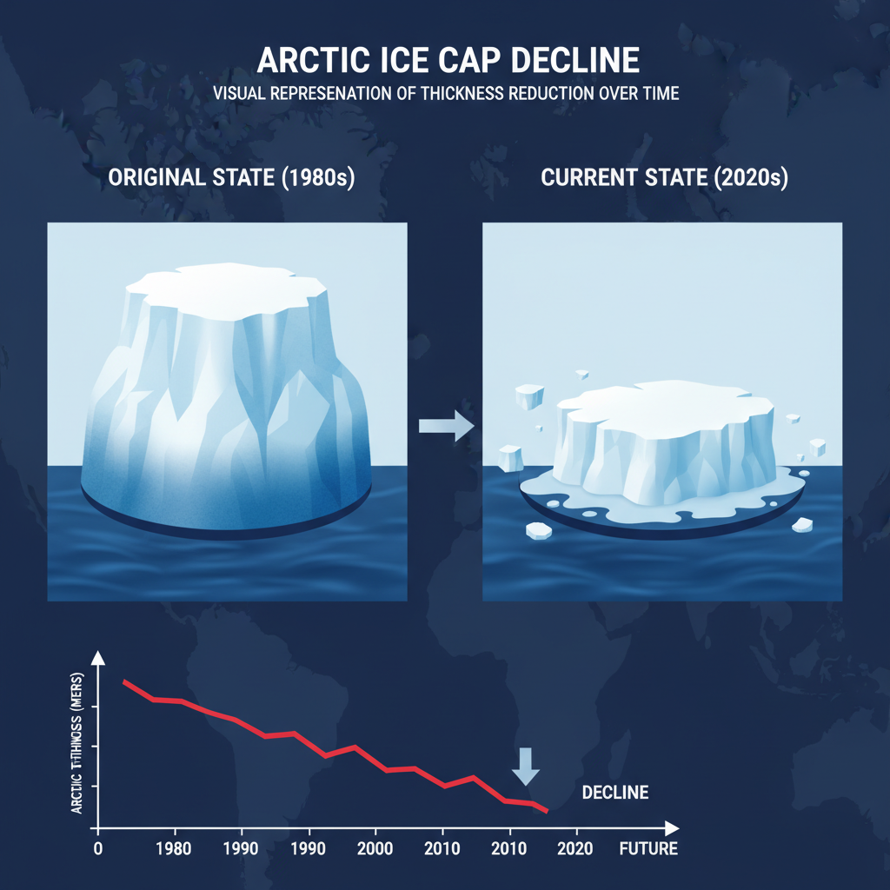
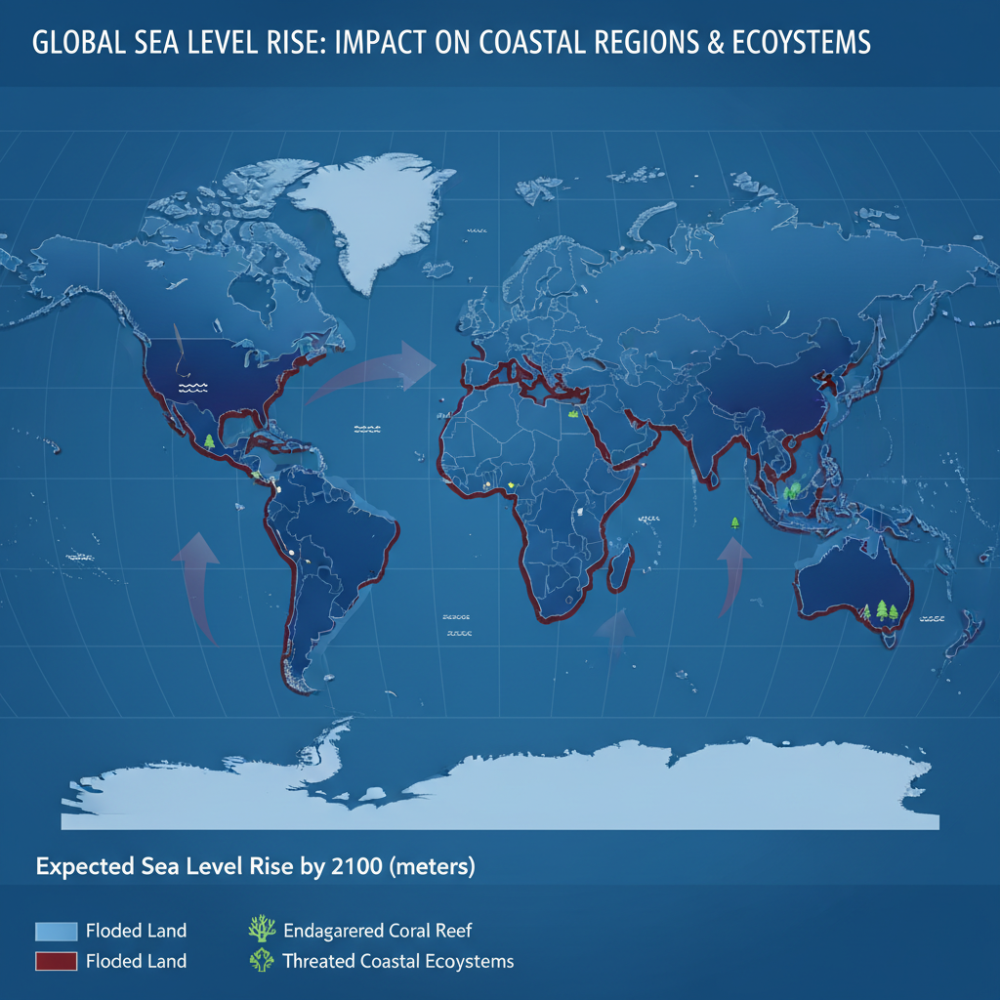
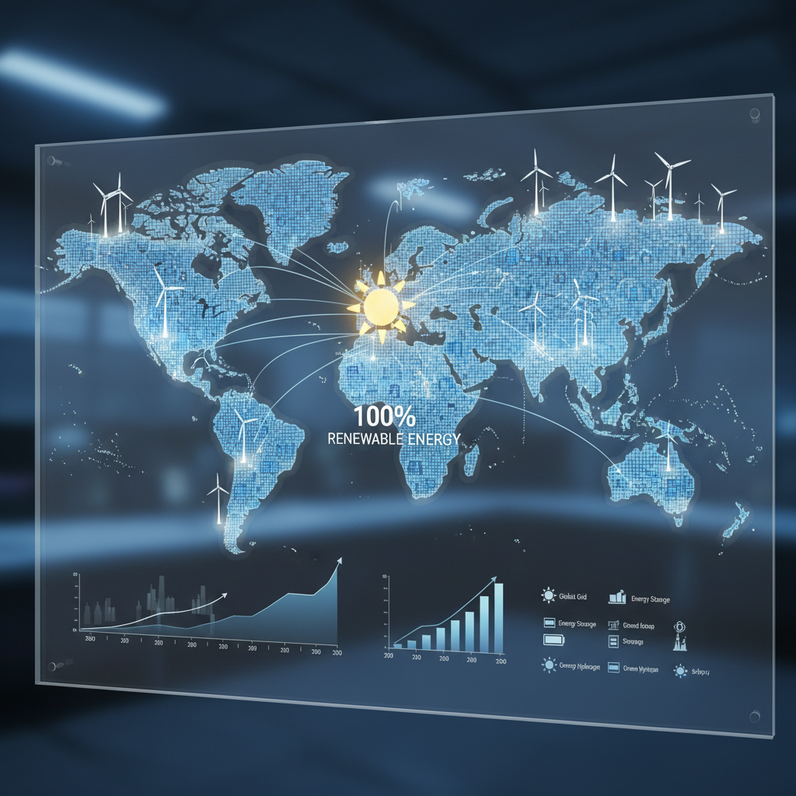

# Understanding Global Warming

## What is Global Warming?

Global warming refers to the long-term rise in Earth's average surface temperature, primarily caused by human activities that release greenhouse gases into the atmosphere. The current understanding of global warming is rooted in scientific research and evidence.

### Key Factors Contributing to Global Warming

*   **The Greenhouse Effect**: When the sun's energy reaches the Earth, some of it is reflected back to space as infrared radiation. Greenhouse gases, such as carbon dioxide (CO2), methane (CH4), and water vapor (H2O), trap this heat in the atmosphere, keeping the planet warm enough to support life. However, human activities have increased the concentration of these gases, amplifying the natural greenhouse effect and leading to global warming.
*   **Human Activities**: Burning fossil fuels, such as coal, oil, and gas, releases large amounts of CO2 into the atmosphere, while deforestation and land-use changes contribute to the loss of carbon sinks. These human activities have significantly increased greenhouse gas emissions, exacerbating global warming.
*   **Atmospheric CO2 Concentration**: The concentration of atmospheric CO2 has been steadily increasing over the past century, primarily due to fossil fuel burning and land-use changes. This increase in CO2 levels is a key driver of global warming, as it enhances the natural greenhouse effect and leads to rising temperatures.

Global warming has far-reaching consequences for the environment, human health, and the economy. Understanding the causes and effects of global warming is crucial for developing effective strategies to mitigate its impacts and adapt to a changing climate.

## Evidence for Global Warming

*Visual representation of Arctic ice cap melting*

Recent research and evidence continue to support the existence of global warming. Key findings include:

* NASA's Goddard Institute for Space Studies has been tracking climate data, which shows a steady increase in temperatures over the past century. ([Source](https://climate.nasa.gov/))
* The Intergovernmental Panel on Climate Change (IPCC) has published several reports highlighting the growing evidence of human-caused global warming. For example, the IPCC's 2021 report states that "it is extremely likely that more than half of the observed increase in global average surface temperature since the mid-20th century is due to human activities." ([Source](https://www.ipcc.ch/report/ar6/wg1/))
* Satellite imagery has become a crucial tool for monitoring temperature increases. By analyzing satellite data, scientists can track changes in sea ice cover, glacier melting, and other indicators of climate change. This technology allows for more accurate and comprehensive assessments of global warming's impacts.

These findings demonstrate the growing body of evidence supporting the existence of global warming. As research continues to unfold, it is essential to stay informed about the latest developments in this critical area of study.

## Consequences of Global Warming

*Visual representation of projected sea level rise by 2100*

Global warming is expected to have far-reaching consequences for ecosystems and human societies. Rising temperatures are projected to impact polar ice caps and sea levels, leading to:

* Thawing of Arctic ice caps, potentially causing sea levels to rise by up to 1 meter by 2100 ([Source](https://www.nature.com/articles/s41558-019-0726-4))
* Melting of glaciers and ice sheets, contributing to rising sea levels and coastal erosion
* Changes in ocean currents and circulation patterns, affecting marine ecosystems

Extreme weather events such as hurricanes, droughts, and heatwaves are also likely to worsen, having significant impacts on:

* Agriculture: changes in temperature and precipitation patterns may lead to crop failures, reduced yields, and shifts in growing seasons ([Source](https://www.pnas.org/content/115/28/7183))
* Infrastructure: increased frequency and severity of extreme weather events may put a strain on urban infrastructure, leading to costly repairs and maintenance

Furthermore, global warming is projected to have severe impacts on biodiversity and ecosystem services, including:

* Loss of coral reefs and other marine ecosystems due to rising ocean temperatures
* Changes in species distributions and extinction risks for many plant and animal species

## Solutions and Mitigation Strategies

*Visual representation of a renewable energy grid, highlighting the role of solar and wind power*

As the world grapples with the challenges of global warming, various solutions and mitigation strategies have emerged to reduce greenhouse gas emissions. Here are some key approaches:

* Renewable energy sources offer a promising alternative to fossil fuels. Solar and wind power, in particular, have become increasingly cost-competitive with traditional energy sources, making them more accessible for widespread adoption.
* Carbon capture and storage (CCS) technologies hold great potential for reducing emissions from industrial sources. By capturing CO2 emissions at source and storing them underground, CCS can significantly decrease the amount of greenhouse gases released into the atmosphere.

Sustainable land use practices are also crucial in mitigating global warming. Reforestation efforts have been shown to sequester large amounts of carbon dioxide from the atmosphere, while agroforestry practices promote soil health and reduce deforestation. Additionally, sustainable agriculture methods can help minimize emissions from farming and other agricultural activities.

While these solutions are promising, it's essential to acknowledge that addressing global warming will require a coordinated effort from governments, industries, and individuals alike.

## Edge Cases and Failure Modes

As we continue to monitor and study global warming, it's essential to consider potential edge cases and failure modes that could impact our understanding and response to this complex issue. Here are some key areas to focus on:

* **Food systems and supply chains**: Climate change may lead to crop failures, changes in temperature and precipitation patterns, and increased frequency of extreme weather events. This can have devastating effects on global food systems, leading to shortages, price increases, and social unrest. For example, a study by the Intergovernmental Panel on Climate Change (IPCC) found that climate change could lead to a 2% decrease in global crop yields by 2050 ([Source](https://www.ipcc.ch/srccl/)).
* **Sudden and extreme weather events**: Events like hurricanes, droughts, or heatwaves can have catastrophic consequences for communities and ecosystems. A sudden and extreme weather event can overwhelm disaster risk reduction and adaptation strategies, leading to significant economic and human losses. For instance, Hurricane Katrina in 2005 caused an estimated $125 billion in damages and resulted in over 1,800 deaths ([Source](https://www.fema.gov/publications/fact-sheet/hurricane-katrina)).
* **Disaster risk reduction and adaptation strategies**: It's crucial to develop and implement effective disaster risk reduction and adaptation strategies to mitigate the impacts of climate-related disasters. This includes investing in early warning systems, building resilient infrastructure, and promoting community-based adaptation initiatives. The United Nations Office for Disaster Risk Reduction (UNDRR) emphasizes the importance of proactive measures to reduce disaster risks and enhance resilience ([Source](https://www.unisdr.org/)).
